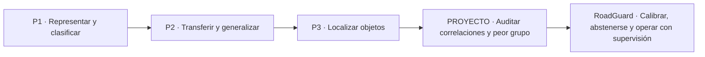
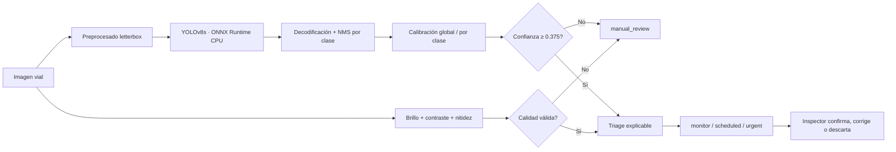

## Zusammenfassung

RoadGuard ist der professionelle Abschluss eines Weges, der mit Bildklassifikation begann, mit Transfer Learning und Data Augmentation fortgesetzt wurde, über Objekterkennung führte und bei der Analyse von Robustheit und Bias ankam. Das neue Projekt wiederholt nicht das Waterbirds-Experiment und stellt auch keinen heruntergeladenen Detektor als eigenes Modell dar. Es formuliert ein anderes Problem, näher an der Produktion:

> Wann darf eine Straßenschaden-Erkennung in eine Inspektionswarteschlange eintreten, und wann muss sich das System enthalten, weil Land, Klasse oder Bildqualität die Konfidenz unzuverlässig machen?

RoadGuard kombiniert:

- einen vortrainierten YOLOv8s-Detektor im ONNX-Format;
- offizielle RDD2022-Daten aus China (MotorBike) und den USA;
- getrennte Auswertung nach Land und visueller Degradation;
- globale und klassenspezifische Konfidenzkalibrierung;
- eine selektive Politik der Annahme oder Enthaltung;
- ein Qualitäts-Gate für dunkle oder unscharfe Bilder;
- erklärbares Triage zur Priorisierung der menschlichen Überprüfung;
- kryptografische Verifikation der Artefakte und lokale Ausführung auf der CPU.

### Hauptergebnis

| Indikator | Rohe Politik | Kalibrierte Politik | Lesart |
|---|---:|---:|---|
| ECE bei sauberen Bildern | 0,089 | 0,029 | relative Reduktion um 67,5 % |
| F1 des schlechtesten Landes | 0,699 | 0,707 | kleine Verbesserung im schlechtesten Fall |
| Menschliche Überprüfung unter allen Bedingungen | — | 45,5 % | bewusste Enthaltung bei Risiko |
| Verarbeitete Evidenz | — | 360 Bilder / 792 Inferenzen | 2 Länder und 3 Bedingungen |

Die Kalibrierung verbessert die Übereinstimmung zwischen Konfidenz und Trefferhäufigkeit, verbessert aber **nicht gleichmäßig den F1-Wert**. Das gepaarte Bootstrap pro Bild schätzt:

- China: ΔF1 = **−0,015**, 95%-KI **[−0,028, −0,003]**.
- USA: ΔF1 = **+0,009**, 95%-KI **[−0,005, +0,026]**.

Der wichtigste Befund betraf die Ontologie, nicht die visuelle Fähigkeit. Das ONNX und seine Metadaten nennen Kanal 3 `Pothole` und Kanal 4 `Other`, aber in der Kalibrierungspartition überschneidet sich Kanal 4 mit 20/20 chinesischen Potholes und Kanal 3 mit 32/33 `Repair/Other`-Regionen. Die Permutation 3↔4 wurde ausschließlich anhand der Kalibrierung festgelegt und explizit dokumentiert, bevor die Auswertung neu erzeugt wurde. Mit der korrekten Zuordnung erreicht `Pothole` einen AP50 von 0,988 in China und 0,683 in den USA. Diese Episode zeigt, dass die Gewichtung einer vermeintlich „schlechtesten Klasse“ vor der Prüfung der Labels dazu führen kann, das falsche Problem zu optimieren.

## 1. Integritäts- und Urheberschaftserklärung

Diese Arbeit unterscheidet drei Arten von Evidenz:

1. **Durch frühere Dateien belegte Ergebnisse.** Es werden nur Metriken zitiert, die in den Notebooks oder Berichten vorhanden sind.
2. **Durch eine Übung eingeführtes Wissen.** Eine Anleitung oder unvollständiger Code kann curriculare Absicht belegen, aber kein experimentelles Ergebnis.
3. **Neuer Beitrag von RoadGuard.** Problemdesign, Artefaktsicherheit, Pipeline-Implementierung, Cross-Domain-Protokoll, Kalibrierung, Enthaltung, Triage, Auswertung, Bootstrap und kritische Analyse.

Der Basis-Detektor wurde in diesem Projekt nicht trainiert. Er ist eine vortrainierte Komponente, die ihrem Urheber zugeschrieben wird. Ihn anders darzustellen wäre falsch. Der eigene Beitrag besteht darin, diese Komponente in ein bewertbares und konservatives System zu verwandeln.

### Was nicht behauptet wird

- Es werden keine eigenen Ergebnisse für P1 beansprucht, da die erhaltene Datei die Anleitung der Übung ist.
- Es wird nicht behauptet, dass P3 ein fertiger Detektor sei: `single_stage_detector.py` enthält noch `TODO` und `pass`.
- Es wird nicht behauptet, dass ein guter aggregierter F1-Wert gleichmäßige Robustheit zwischen Ländern oder Bedingungen impliziert.
- Land wird nicht als geschützte Gruppe interpretiert, noch „schlechtestes Land“ als demografisches Fairness-Maß.
- Eine visuelle Blackbox wird nicht in eine strukturelle Diagnose umgewandelt.

## 2. Von der Datei zum professionellen Kriterium

Die Durchsicht von `p1`, `ARBELAEZ_JOSE_P2`, `ARBELAEZ_JOSE_P3`, `PROYECTO` und `Teoria` ergibt eine klare Entwicklung:



| Etappe | Gefundene Evidenz | Kompetenz | Erkannte Grenze |
|---|---|---|---|
| P1 | Anleitung PR1.1 zu CNN, AlexNet und ResNet | Formulierung von Klassifikation und Auswertung | keine überprüfbaren eigenen Ergebnisse in der Datei |
| P2 | Notebooks und Bericht mit vier Strategien | Transfer Learning und Augmentation mit empirischem Vergleich | mehr Transformationen garantieren keine Generalisierung |
| P3 | Notebook und `single_stage_detector.py` | Boxen, IoU, Offsets, Konfidenz und NMS | unvollständige Implementierung |
| PROYECTO | Waterbirds, ResNet/DINO, schlechteste Gruppe und Grad-CAM | Scheinkorrelationen, ID/OOD und Gruppenanalyse | bereits erforschtes akademisches Problem; eine Wiederholung war kein ausreichender nächster Schritt |
| RoadGuard | Code, verifiziertes ONNX, reproduzierbare Stichprobe und Ergebnisse | selektive Verlässlichkeit, Sicherheit, Domain Shift und Human-in-the-Loop | ersetzt keine strukturelle Inspektion und deckt nicht alle Regionen ab |

### 2.1 P1 — Klassifikation formulieren lernen

P1 führt die Grundeinheit des Kurses ein: Ein Bild wird in eine Convolutional-Architektur eingespeist und erzeugt eine Kategorie. Sein Wert im Portfolio ist curricular. Es etabliert die Fragen zu Datenpartitionierung, Repräsentation, Optimierung und Auswertung. Die Arbeit erfindet keine Accuracy oder Kurven, weil das archivierte Material der Aufgabenstellung entspricht.

### 2.2 P2 — vom Training von Grund auf zum Transfer

P2 enthält eine vollständige experimentelle Geschichte:

| Strategie | Erfasstes Ergebnis | Erkenntnis |
|---|---:|---|
| CNN von Grund auf | Maximum 0,775; letzte Epoche 0,755 | ein Netz kann die Menge lernen, ohne gut zu generalisieren |
| Vortrainierte Repräsentationen + SVM | 0,880 | übertragbare Merkmale senken die Lernkosten |
| Fine-Tuning ohne Augmentation | 0,915 | die Anpassung der Repräsentation an die Domäne ist wichtig |
| Fine-Tuning mit Augmentation | 0,940 | nützliche Variation kann die Robustheit verbessern |

Das Augmentation-Experiment liefert eine noch wichtigere Lektion:

| Transformation | Ergebnis |
|---|---:|
| Baseline | 75,97 % |
| Horizontal Flip | 79,01 % |
| Random Crop | **79,38 %** |
| Flip + Crop | 78,95 % |
| Rotation | 76,53 % |
| Random Erasing | 78,44 % |
| Color Jitter | 76,45 % |
| alle kombiniert | **71,19 %** |

Die komplexeste Kombination war die schlechteste. Die auf RoadGuard übertragene Schlussfolgerung ist, dass eine Transformation eine Hypothese über die Umgebung repräsentieren muss. `dark` und `blur` sind explizite Stresstests; sie werden nicht hinzugefügt, um „mehr Daten“ ohne wissenschaftliche Frage zu erzeugen.

### 2.3 P3 — Lokalisieren und technische Schuld erkennen

P3 verändert das Problem: Eine Vorhersage muss Klasse, Box und Konfidenz enthalten. Es tauchen IoU, Foreground/Background, Offset-Regression und NMS auf. Der Code enthält jedoch weiterhin nicht implementierte Teile. Die Evidenz belegt ein partielles Verständnis des Single-Stage-Detektors, keine fertige Lösung.

RoadGuard verwandelt diese Einschränkung in eine ehrliche Ingenieursentscheidung: einen verifizierbaren, vortrainierten Detektor zu verwenden und die neue Arbeit den Problemen zu widmen, die P3 nicht löste:

- Transfer zwischen Domänen;
- klassenweise Auswertung;
- Konfidenzkalibrierung;
- Zurückweisung unsicherer Vorhersagen;
- visuelle Qualitätskontrolle;
- Betrieb mit einer Person im Regelkreis.

### 2.4 PROYECTO — von Accuracy zur schlechtesten Gruppe

Waterbirds zeigt, dass eine globale Metrik die schlechteste Untergruppe verbergen kann.

| Modell | ID global | ID schlechteste Gruppe | OOD global | OOD schlechteste Gruppe |
|---|---:|---:|---:|---:|
| ResNet original | 0,862 | 0,608 | 0,810 | 0,541 |
| ResNet angepasst | 0,925 | 0,801 | 0,889 | 0,773 |
| DINO Standard | 0,819 | 0,626 | 0,837 | 0,642 |
| DINO angepasst | 0,913 | 0,852 | 0,919 | 0,810 |

Die Erkenntnis besteht nicht darin, „Waterbirds erneut zu prüfen“. Es geht darum, das Prinzip zu übernehmen, dass der schlechteste Fall zählt, und es auf ein anderes Problem zu übertragen. RoadGuard nutzt Land als Robustheitsdomäne und fügt eine operative Antwort hinzu: Wenn die Evidenz nicht ausreicht, enthält sich das System.

## 3. Ausgewählter theoretischer Rahmen

Aus `Teoria` wurden die Konzepte ausgewählt, die direkt mit dem neuen Problem zusammenhängen.

| Konzept | Operative Idee | Umgesetzte Entscheidung |
|---|---|---|
| IoU, Precision–Recall und AP | Accuracy misst weder Lokalisierung noch Fehlalarme | Match nach Klasse + IoU ≥ 0,50; AP50, P/R/F1 |
| NMS | überlappende Boxen konkurrieren, und der Schwellenwert beeinflusst den Recall | explizites NMS pro Klasse |
| Domain Shift | ein in einer Domäne trainiertes Modell kann in einer anderen abfallen | getrennte Berichterstattung nach Land und schlechtester Domäne |
| Anpassung mit wenigen Ziel-Labels | eine kleine Stichprobe kann eine Entscheidungsschicht anpassen | Kalibrator, gelernt mit 72 Bildern pro Land |
| Explainability und Audit | Daten, Entscheidungen, Grenzen und Lebenszyklus dokumentieren | Manifest, Hashes, vollständige Tabellen und Fehleranalyse |
| Human Oversight | eine Person benötigt Kontext und Befugnis zum Eingreifen | `manual_review`, Gründe und nicht bindende Priorität |
| Exaktheit und Sicherheit | Verlässlichkeit ist eine Systemeigenschaft | Quality Gate, Enthaltung und Artefaktverifikation |

### Kalibrierung

Eine Konfidenz von 0,90 bedeutet nicht automatisch, dass neun von zehn Erkennungen korrekt sind. Die Kalibrierung versucht, Konfidenz mit empirischer Trefferhäufigkeit in Einklang zu bringen.

RoadGuard verwendet Platt Scaling auf dem Logit der rohen Konfidenz:

$$
\hat{p}(y=1\mid s,c) = \sigma\!\left(a_c\operatorname{logit}(s)+b_c\right)
$$

wobei `s` die Konfidenz, `c` die Klasse ist und die klassenspezifischen Parameter ausschließlich in der Kalibrierung geschätzt werden. Enthält eine Klasse ausreichend Beobachtungen, sind aber alle fehlerhaft, wird eine konstante Wahrscheinlichkeit mit Laplace-Glättung verwendet. Es ist eine konservative Antwort auf negative Evidenz, keine Korrektur der Boxen.

### Selektive Klassifikation

Die Politik zwingt das Modell nicht, sich immer zu entscheiden:

$$
g(x)=
\begin{cases}
\text{akzeptieren}, & \hat{p}\ge \tau \land q(x)=1,\\
\text{manuelle Überprüfung}, & \text{andernfalls}.
\end{cases}
$$

Der Schwellenwert `τ = 0,375` wurde in der Kalibrierung als bester F1-Wert unter Kandidaten mit einer Mindestpräzision von 0,75 gewählt. Der Evaluationssatz greift bei dieser Auswahl nicht ein.

> **Wichtige Unterscheidung.** „Schlechtestes Land“ ist ein Maß für Domänenrobustheit. Es ist kein Maß für demografische Gerechtigkeit; eine Fairness-Bewertung würde soziale Variablen und einen geeigneten Rahmen erfordern.

## 4. Problem, Ziel und Fragestellungen

### Problem

Straßennetze erzeugen zu viele Bilder für eine erschöpfende manuelle Überprüfung. Ein Detektor kann Evidenz priorisieren, aber:

- ein Fehlalarm kostet Zeit und Budget;
- ein falsches Negativ kann Schäden verbergen;
- Kamera, Fahrbahn, Wetter und Beschilderung ändern sich zwischen Ländern;
- eine überschätzte Konfidenz kann nützlicher erscheinen, als sie tatsächlich ist.

### Allgemeines Ziel

Ein lokales, reproduzierbares und konservatives System entwerfen und bewerten, das Straßenschäden erkennt, die Konfidenz außerhalb der Trainingsdomäne kalibriert und unsichere Vorhersagen an die menschliche Überprüfung weiterleitet.

### Forschungsfragen

- **RQ1.** Reduziert die Kalibrierung den Expected Calibration Error bei sauberen Bildern?
- **RQ2.** Verbessert eine kalibrierte Politik den F1-Wert des schlechtesten Landes gegenüber dem rohen Schwellenwert?
- **RQ3.** Welche visuelle Degradation erzeugt das größte operative Risiko?
- **RQ4.** Welche Klassen verhindern einen autonomen Einsatz, und wie soll das System reagieren?

### Hypothesen

- **H1.** Die Kalibrierung wird den ECE reduzieren, ohne die Auswertung zur Parameterwahl zu nutzen.
- **H2.** Die selektive Zurückweisung wird Präzision und F1 in beiden Ländern erhöhen, auf Kosten der Abdeckung.
- **H3.** `blur` wird einen größeren Recall-Verlust verursachen als eine moderate Reduktion der Beleuchtung.
- **H4.** Klassen mit geringem Transfer werden eine klassenspezifische Enthaltung erfordern, keinen optimistischen globalen Schwellenwert.

## 5. Architektur von RoadGuard



### Komponenten

1. `data.py`: Audit des ZIP, VOC-Parsing, deterministisches Sampling und Bildqualität.
2. `detector.py`: ONNX-Laden, Letterbox, YOLO-Dekodierung und NMS.
3. `metrics.py`: IoU, Matching, AP50, ECE und Metriken pro Politik.
4. `calibration.py`: globales und klassenweises Platt Scaling mit konservativem Fallback.
5. `triage.py`: Annahme, Überprüfung und beratende Priorität.
6. `visualize.py`: Verlässlichkeit, Politikvergleich, Stress und Beispiele.
7. `run_experiment.py`: vollständiges Protokoll und reproduzierbare Artefakte.

## 6. Modell, Daten und Sicherheit

### Modell

Gewählt wurde `vinothvikas1987/pothole-detection-yolov8`, fester Commit `b001687443175e43442f63bef4691c3546629def`.

| Eigenschaft | Wert |
|---|---|
| Format | ONNX, kein Pickle |
| Größe | 44,8 MB |
| Eingabe | `[1, 3, 640, 640]` |
| Ausgabe | `[1, 9, 8400]` |
| Graph | IR 9, 231 Knoten, validiert mit `onnx.checker` |
| Runtime | ONNX Runtime CPU |
| Klassen | longitudinal, transverse, alligator, pothole, other |
| SHA-256 | `590A20E8C4A7BCBDB32E8A3B7B3A3C1D57D1FA8A7DDE5C83FCEC8928A4AA753F` |

Es wurden keine `.pt`/`.pkl`-Gewichte heruntergeladen. ONNX beseitigt nicht alle Risiken einer Lieferkette, verhindert aber, dass beim Laden des Modells ein serialisiertes Python-Objekt ausgeführt wird. Der Hash legt das ausgewertete Artefakt exakt fest.

### Kompatibilität mit dem Laptop

| Ressource | Evidenz |
|---|---|
| CPU | Intel Core Ultra 7 155H |
| RAM | 31,6 GB |
| GPU | integrierte Intel Arc; für das Protokoll nicht erforderlich |
| Ausführung | 792 Inferenzen in ~108 s Rechenzeit |
| beobachtete Leistung | etwa 7,4 Bilder/s |

Das Projekt vermeidet eine CUDA-Abhängigkeit. Es kann auf dem Laptop mit reichlich Arbeitsspeicher und Speicherplatz reproduziert werden.

### Daten

Es wurden offizielle RDD2022-Dateien verwendet:

| Artefakt | Größe | SHA-256 |
|---|---:|---|
| China MotorBike ZIP | 192.030.116 Bytes | `2ACDC8B8527C9B36CCE4BA97DFDD5BE9090BE32F588C31B769A08C1A41C0C274` |
| United States ZIP | 444.335.958 Bytes | `597E8BCF1FFBE80D6C8295FBF99EBAB5651C9E4EFE961F9D38A9ED4AD10B957E` |

Vor dem Entpacken wurde geprüft, dass die Einträge ausschließlich Bilder/XML waren und weder absolute Pfade noch `..` enthielten.

### Partition

| Land | Kalibrierung | Auswertung | Auswertungsbedingungen |
|---|---:|---:|---|
| China · MotorBike | 72 | 108 | clean, dark, blur |
| USA | 72 | 108 | clean, dark, blur |

Insgesamt: 360 verschiedene Bilder. Jedes Auswertungsbild wird in drei Bedingungen verarbeitet, aber diese Transformationen werden nicht als unabhängige Stichproben behandelt.

## 7. Experimentelles Protokoll

### Variablen

- Unabhängige Einheit für statistische Inferenz: **Bild**.
- Echter Positivfall: gleiche Klasse und IoU ≥ 0,50 mit einer nicht zugeordneten Annotation.
- Basis-Policy: `confidence ≥ 0.25`.
- Kalibrierte Policy: `calibrated_confidence ≥ 0.375`.
- Bedingungen: `clean`, `dark` und `blur`.
- Sampling- und Bootstrap-Seed: 2026.

### Metriken

- precision, recall und F1;
- AP50 pro Klasse;
- Expected Calibration Error mit 10 Bins;
- schlechtester F1-Wert zwischen Ländern;
- Rate der Weiterleitung an menschliche Überprüfung;
- 95%-KI mit 2.000 Bootstrap-Resamplings pro Bild.

Die Lokalisierung wird mittels Intersection over Union bewertet:

$$
\operatorname{IoU}(B_p,B_g)
=
\frac{|B_p\cap B_g|}{|B_p\cup B_g|}.
$$

Eine Box gilt als echter Positivfall, wenn sie in der Klasse übereinstimmt und $\operatorname{IoU}\ge 0.50$ erfüllt. Aus den Zuordnungen:

$$
\operatorname{Precision}=\frac{TP}{TP+FP},
\qquad
\operatorname{Recall}=\frac{TP}{TP+FN},
$$

$$
F_1=2\frac{\operatorname{Precision}\cdot\operatorname{Recall}}
{\operatorname{Precision}+\operatorname{Recall}}.
$$

Die Kalibrierung wird mittels ECE zusammengefasst. Für $M=10$ Konfidenzintervalle:

$$
\operatorname{ECE}
=
\sum_{m=1}^{M}\frac{|S_m|}{n}
\left|\operatorname{acc}(S_m)-\operatorname{conf}(S_m)\right|.
$$

Das Bootstrap-Verfahren erhält das Bild als unabhängige Einheit. Für das Resampling $b$ ist die gepaarte Verbesserung:

$$
\Delta F_1^{(b)} = F_{1,\mathrm{cal}}^{(b)}-F_{1,\mathrm{raw}}^{(b)},
$$

und das 95%-Intervall verwendet die Perzentile 2,5 und 97,5 der 2.000 Replikate.

### Kontrolle gegen Leakage

Der Kalibrator und der Schwellenwert werden ausschließlich mit den 144 Kalibrierungsbildern angepasst. Die 216 Evaluierungsbilder verändern keinen Parameter.

### Triage

Die Priorität kombiniert Klasse, relative Fläche und kalibrierte Konfidenz:

- `monitor`: akzeptiertes Signal niedriger Priorität;
- `scheduled`: in eine planmäßige Inspektion aufnehmen;
- `urgent`: zeitnah überprüfen;
- `manual_review`: keine ausreichende automatische Evidenz.

Diese Etiketten organisieren Arbeit. Sie schätzen weder Tiefe noch autorisieren sie eine Straßenmaßnahme.

## 8. Ergebnisse

### 8.1 Ontologie-Audit

Die erste Evaluierung ergab AP50 = 0 für `Pothole` und nahezu 0 für `Other`. Bevor dies als Unfähigkeit des Modells interpretiert wurde, wurde für jede Annotation gemessen, ob ein räumlicher Vorschlag mit IoU ≥ 0,50 existierte, unabhängig von der Klasse. Das Ergebnis zeigte eine nahezu exakte Permutation der beiden letzten Kanäle.

| Evidenz in der Kalibrierung | Pothole | Repair / Other |
|---|---:|---:|
| China · Annotationen | 20 | 33 |
| Bester ONNX-Kanal 4 | 20/20 | 0/33 |
| Bester ONNX-Kanal 3 | 0/20 | 32/33 |
| USA · abgedeckte Potholes | Kanal 4 in 13/14 | keine Unterstützung für `Other` |

Die kanonische Zuordnung wurde festgelegt als $m(3)=4$ und $m(4)=3$. `predictions.csv` bewahrt sowohl `model_class_id` als auch `class_id`, und `models/class_mapping.json` dokumentiert die Entscheidung. Die Evaluierung wurde nicht zur Auswahl des Mappings verwendet.

### 8.2 Zuverlässigkeit der Konfidenz

<figure class="roadguard-chart" data-roadguard-chart="reliability"><div class="roadguard-chart__header"><div><span class="roadguard-chart__eyebrow">Kalibrierung</span><h4>Zuverlässigkeit der Konfidenz</h4><p>Evaluierung mit sauberen Bildern</p></div><span class="roadguard-chart__metric">ECE <strong>0.089 → 0.029</strong></span></div><div class="roadguard-chart__canvas"><canvas role="img" aria-label="Comparación entre la confianza original, la confianza calibrada y la calibración perfecta"></canvas></div><figcaption>Die kalibrierte Kurve nähert sich stärker der Diagonale perfekter Kalibrierung an.</figcaption></figure>

Der ECE-Wert für saubere Bilder sinkt von **0,089** auf **0,029**. Die Kalibrierung bringt Konfidenz und empirische Genauigkeit näher zusammen, garantiert aber nicht, dass ein einziger Schwellenwert F1 in allen Domänen maximiert.

### 8.3 Vollständige Ergebnisse nach Land und Bedingung

| Land | Bedingung | Policy | Precision | Recall | F1 |
|---|---|---|---:|---:|---:|
| China | clean | roh | **0,868** | 0,907 | **0,887** |
| China | clean | kalibriert | 0,840 | 0,907 | 0,872 |
| China | dark | roh | **0,867** | **0,897** | **0,882** |
| China | dark | kalibriert | 0,851 | 0,894 | 0,872 |
| China | blur | roh | 0,859 | 0,449 | 0,589 |
| China | blur | kalibriert | **0,865** | **0,494** | **0,629** |
| USA | clean | roh | **0,725** | 0,674 | 0,699 |
| USA | clean | kalibriert | 0,707 | **0,707** | **0,707** |
| USA | dark | roh | **0,731** | 0,656 | 0,691 |
| USA | dark | kalibriert | 0,707 | **0,715** | **0,711** |
| USA | blur | roh | 0,455 | 0,148 | 0,223 |
| USA | blur | kalibriert | **0,462** | **0,181** | **0,261** |

<figure class="roadguard-chart roadguard-chart--policy" data-roadguard-chart="policy"><div class="roadguard-chart__header"><div><span class="roadguard-chart__eyebrow">Selektive Policy</span><h4>Basis-Policy vs. kalibrierte Policy</h4><p>Precision, Recall und F1 nach Domäne bei sauberen Bildern</p></div><span class="roadguard-chart__metric">Schlechtester F1 <strong>0.699 → 0.707</strong></span></div><div class="roadguard-chart__canvas"><canvas role="img" aria-label="Comparación de precisión, recall y F1 para las políticas cruda y calibrada en China y Estados Unidos"></canvas></div><figcaption>Die Kalibrierung verändert das Gleichgewicht zwischen Precision und Abdeckung in jedem Land auf unterschiedliche Weise.</figcaption></figure>

Die kalibrierte Policy tauscht Precision und Recall je nach Domäne unterschiedlich aus. Sie hilft bei Blur und in den USA, verringert aber F1 bei sauberen und dunklen Bildern in China. Deshalb wird sie als Policy probabilistischer Zuverlässigkeit beibehalten, nicht als Behauptung universeller Überlegenheit in der Klassifikation.

### 8.4 Bootstrap-Intervalle

| Land | Schätzung | Mittelwert | 95%-KI |
|---|---|---:|---:|
| China | F1 roh | 0,886 | [0,851, 0,921] |
| China | F1 kalibriert | 0,871 | [0,834, 0,906] |
| China | ΔF1 | **−0,015** | **[−0,028, −0,003]** |
| USA | F1 roh | 0,697 | [0,642, 0,753] |
| USA | F1 kalibriert | 0,706 | [0,656, 0,759] |
| USA | ΔF1 | **+0,009** | **[−0,005, +0,026]** |

Das gepaarte Intervall bestätigt eine kleine, aber konsistente Reduktion in China; in den USA schließt es Null ein. Die korrekte Schlussfolgerung lautet, dass die Kalibrierung ECE und die schwächste Domäne verbessert, der globale Schwellenwert jedoch die Baseline nicht in jedem Land dominiert.

### 8.5 Visueller Stresstest

<figure class="roadguard-chart roadguard-chart--stress" data-roadguard-chart="stress"><div class="roadguard-chart__header"><div><span class="roadguard-chart__eyebrow">Stresstest</span><h4>Robustheit gegenüber visuellen Degradationen</h4><p>F1 der kalibrierten Policy nach Land und Bedingung</p></div><span class="roadguard-chart__metric">Minimaler F1 <strong>0.261</strong></span></div><div class="roadguard-chart__canvas"><canvas role="img" aria-label="F1 de la política calibrada con imágenes limpias, oscuras y desenfocadas en China y Estados Unidos"></canvas></div><figcaption>Die Unschärfe konzentriert den größten Verlust, besonders in den USA.</figcaption></figure>

`dark` verändert das saubere Ergebnis kaum. `Blur` ist der Hauptfehlerfaktor: Es zerstört Kanten und Lokalisierung, sodass ein besserer Schwellenwert nur die Precision schützen, nicht die verlorene Information wiederherstellen kann.

## 9. Analyse nach Klasse und Fehlern

### AP50 bei sauberen Bildern

| Land | Klasse | Ground Truth | AP50 |
|---|---|---:|---:|
| China | Longitudinal Crack | 130 | 0,874 |
| China | Transverse Crack | 53 | 0,854 |
| China | Alligator Crack | 58 | 0,977 |
| China | Pothole | 33 | **0,988** |
| China | Other | 38 | **0,974** |
| USA | Longitudinal Crack | 130 | 0,768 |
| USA | Transverse Crack | 68 | 0,692 |
| USA | Alligator Crack | 40 | 0,878 |
| USA | Pothole | 32 | **0,683** |

Nach der Angleichung der Ontologie verfügen alle sauberen Klassen über ein nützliches Signal. Die relevante Lücke betrifft die Domäne: `Pothole` fällt von 0,988 in China auf 0,683 in den USA und auf 0,179 bei US-amerikanischem Blur. Dieser Unterschied ist zusammen mit dem allgemein niedrigen Recall bei Blur die richtige Motivation für kontinuierliches Lernen und gruppenspezifische Robustheit.

### Konservative Reaktion des Kalibrators

Nach dem Mapping lernt der Kalibrator nicht-degenerierte Parameter für alle fünf Klassen. Die Kalibrierung reduziert ECE, aber die Bootstrap-Analyse verhindert, dass bessere Wahrscheinlichkeit mit besserem F1 in allen Domänen verwechselt wird.

> **Wissenschaftlicher Befund.** Die Zuverlässigkeit ist je nach Klasse heterogen. Ein globaler Schwellenwert verbirgt diese Struktur; die Kalibrierung pro Klasse macht sie zu einer Sicherheitsregel.

### Abdeckung und menschliche Belastung

| Ausgabe | Fälle | Anteil |
|---|---:|---:|
| `manual_review` | 295 | 45,5% |
| `monitor` | 192 | 29,6% |
| `scheduled` | 138 | 21,3% |
| `urgent` | 23 | 3,5% |

Eine hohe Überprüfungsrate ist nicht automatisch gut. Hier spiegelt sie hauptsächlich absichtliche Unschärfe und die geringere Abdeckung der US-Domäne wider. In der Produktion sollte die Risiko-Abdeckungs-Kurve mit realen Kosten und lokalen Daten optimiert werden.

## 10. Qualitative Evidenz

| China · MotorBike | USA |
|---|---|
|  |  |
|  |  |

Kritische Lesart:

- der Detektor kann lange Schäden in mehrere Boxen fragmentieren;
- NMS kontrolliert Duplikate, ersetzt aber keine Segmentierung;
- die US-amerikanische Stadtszene fügt Fahrzeuge, Markierungen und Perspektive hinzu;
- die Fläche einer Box ist eine visuelle Näherung, keine strukturelle Schwere;
- Street View und MotorBike repräsentieren unterschiedliche Aufnahme-Pipelines.

## 11. Verantwortungsvolle Nutzung

RoadGuard ist eine Inspektionsunterstützung, nicht:

- Fahrzeugkontrolle;
- bautechnische Diagnose;
- Gutachten;
- Bauabnahme;
- automatische Sperrung einer Straße.

`urgent` bedeutet **mit Priorität überprüfen**, niemals automatisch eine Maßnahme ausführen.

### Risiken und Kontrollen

| Risiko | Umgesetzte Kontrolle | Vor der Produktion |
|---|---|---|
| falsche Sicherheit | Kalibrierung, Abstention und AP pro Klasse | prospektive lokale Validierung und kostenbasierter Schwellenwert |
| Kamera- oder Länderwechsel | Bericht pro Domäne und Stresstest | Drift-Monitor und Referenz-Batch |
| degradiertes Bild | Quality Gate | Neuaufnahme anfordern und Metadaten bewahren |
| begrenzte Abdeckung | zwei Domänen und explizite Grenzen | Nacht, Wetter, Regionen und Beläge hinzufügen |
| unangemessene Automatisierung | `manual_review` und Advisory-Priorität | Interface mit Override, Begründungen und Audit |
| Lieferkette | ONNX, Hash und ZIP-Audit | SBOM, isolierte Umgebung und Lizenzprüfung |

### Bedeutungsvolle menschliche Aufsicht

Es reicht nicht, eine Box anzuzeigen und die gesamte Verantwortung an eine Person zu übertragen. Die Oberfläche sollte anzeigen:

- Land/Kamera oder bekannte Domäne;
- visuelle Qualität;
- Klasse und kalibrierte Konfidenz;
- Ablehnungsgrund;
- Modellhistorie;
- Möglichkeit zu korrigieren, zu verwerfen und zu eskalieren;
- Protokoll der endgültigen Entscheidung.

Korrekturen sollten in eine Warteschlange für Neu-Etikettierung und Neukalibrierung einfließen.

### Go/No-Go-Kriterien

- **NO-GO** für autonome Wartungsentscheidungen, selbst wenn die visuelle Klasse korrekt ist.
- **NO-GO**, wenn die Qualität versagt oder die Domäne nicht validiert wurde.
- **Begrenztes GO** zur Priorisierung akzeptierter Schäden, stets mit Überprüfung und mit dem Ontologie-Mapping versionsgesperrt.
- Neu kalibrieren, wenn ECE, Abdeckung oder Precision die vereinbarten Betriebsgrenzen überschreiten.

## 12. Was ich gelernt habe

### Technische Erkenntnisse

1. Transfer Learning reduziert die Kosten für das Erlernen von Repräsentationen, überträgt aber auch Annahmen der Quelldomäne.
2. Data Augmentation ist eine Hypothese über Invarianzen; die Kombination von Transformationen kann das Signal zerstören.
3. In der Detektion bilden Klasse, Lokalisierung, Duplikate und Schwellenwert ein einziges Problem.
4. Eine scheinbar fehlerhafte Klasse kann ein Ontologiefehler sein; Etiketten müssen vor einer Änderung der Verlustfunktion geprüft werden.
5. Die Kalibrierung korrigiert keine Boxen; sie korrigiert, wie deren Konfidenz interpretiert wird.
6. Abstention verwandelt Unsicherheit in eine Schnittstelle zwischen Modell und Person.

### Wissenschaftliche Erkenntnisse

1. Die Trennung von Kalibrierung und Evaluierung verhindert, dass das Ergebnis erst nach der Beobachtung ausgewählt wird.
2. Die Intervalle müssen die unabhängige Einheit respektieren: hier das Bild.
3. Ein lokalisierter und reproduzierbarer Fehler ist informativer als eine globale Zahl ohne Diagnose.
4. Die Schlussfolgerung muss proportional zur Evidenz sein: zwei Länder repräsentieren nicht die Welt.
5. Die Fehleranalyse kann den legitimen Umfang des Produkts verändern.

### Berufliche Erkenntnisse

1. Format, Hash und Herkunft zu überprüfen ist Teil des Aufbaus angewandter KI.
2. Das Dokumentieren von Unvollständigem erhöht die Glaubwürdigkeit.
3. Ein verantwortungsvolles System definiert, was es nicht tun darf, bevor es zeigt, was es kann.
4. Eine Person muss über echte Information und Autorität verfügen, nicht als dekorative „ethische Schicht“ fungieren.

> Die gesamte Entwicklung lässt sich so zusammenfassen: Ich bin von der Frage „Welche Accuracy erziele ich?“ zur Frage übergegangen: „Unter welchen Bedingungen, für wen und mit welchem Wiederherstellungsmechanismus kann ich dieser Ausgabe vertrauen?“.

## 13. Schlussfolgerungen und nächste Etappe

RoadGuard integriert Klassifikation, Transfer, Augmentation, Detektion, Robustheit und Audit in einem ausführbaren System. Die Kalibrierung reduziert ECE, obwohl ihr globaler Schwellenwert F1 nicht in allen Domänen verbessert. Der Stresstest identifiziert Blur als Bedrohung, und das Audit deckt eine stille Permutation von Klassen auf, die zu einer falschen Schlussfolgerung über `Pothole` geführt hätte.

Der nächste wissenschaftliche Schritt ist nicht, ein größeres Modell herunterzuladen. Er besteht darin:

1. die Zuordnung zwischen Modellkanälen und Zielontologie zu sperren und zu verifizieren;
2. kontinuierlich aus US-amerikanischen Fällen, Blur und menschlichen Korrekturen zu lernen;
3. Forgetting nach jeder Anpassungsepisode zu messen;
4. SVM, Prototypen und einen metrischen Kopf mit Replay zu vergleichen;
5. Optimierung nach schlechtester Gruppe erst nach dem Audit der Etiketten anzuwenden;
6. Risk-Coverage-Kurven und konforme Vorhersage pro Domäne zu untersuchen;
7. den Detektor anzupassen, falls der räumliche Vorschlag, nicht die Klasse, den Recall begrenzt.

### Fahrplan

Die vollständige Methodik der Fortsetzung befindet sich in [`FASE_II_APRENDIZAJE_CONTINUO.md`](FASE_II_APRENDIZAJE_CONTINUO.md). Sie wird als Präregistrierung vorgestellt: Sie definiert Entscheidungen und Kriterien vor dem Training, ohne noch nicht existierende Ergebnisse zuzuschreiben.

| Phase | Frage | Ausstiegskriterium |
|---|---|---|
| Zieldaten | Bedeuten die Etiketten dasselbe? | Übereinstimmung zwischen Annotatoren und Datasheet |
| Anpassung | Stellen wenige Beispiele Pothole wieder her? | AP50/Recall mit KI pro Land |
| Kalibrierung | Wird das Risiko bei besserer Abdeckung reduziert? | Risk-Coverage-Kurve und erwartete Kosten |
| Pilot | Hilft es dem Inspektor, ohne ihn zu überlasten? | Zeit, Override und falsche Negative |
| Betrieb | Bleibt es stabil? | Drift-Monitor und Rollback-Plan |

## 14. Reproduzierbarkeit

### Struktur

```text
ARBELAEZ_JOSE_CAPSTONE_ROADGUARD/
├── MEMORIA_PORTAFOLIO.md
├── README.md
├── SECURITY_AND_PROVENANCE.md
├── data/
│   ├── raw/
│   └── sample/manifest.csv
├── docs/EXPERIMENT_PROTOCOL.md
├── models/road_distress_yolov8s.onnx
├── outputs/
│   ├── figures/
│   └── tables/
├── scripts/
│   ├── demo.py
│   ├── prepare_sample.py
│   ├── run_experiment.py
│   └── verify_artifacts.py
├── src/roadguard/
└── tests/test_core.py
```

### Ausführung

```powershell
python -m venv .venv
.\.venv\Scripts\python -m pip install -r requirements.txt
.\.venv\Scripts\python scripts\verify_artifacts.py
.\.venv\Scripts\python scripts\prepare_sample.py
.\.venv\Scripts\python scripts\run_experiment.py
.\.venv\Scripts\python -m pytest -q
```

Demo mit einem Bild:

```powershell
.\.venv\Scripts\python scripts\demo.py ruta\a\imagen.jpg
```

### Auditierbare Ausgaben

| Datei | Verwendung |
|---|---|
| `predictions.csv` | Box, Klasse, Konfidenz und Korrektheit pro Vorhersage |
| `image_results.csv` | Ground Truth, Bedingung und Qualität pro Bild |
| `summary_metrics.csv` | P/R/F1 nach Land, Bedingung und Policy |
| `per_class_ap.csv` | AP50 und Support pro Klasse |
| `bootstrap_f1.csv` | Konfidenzintervalle pro Land |
| `calibrator.json` | gelernte Parameter |
| `triage_results.csv` | Akzeptanz, Grund und Priorität |
| `experiment_summary.json` | maschinenlesbare Zusammenfassung |

Die automatisierten Tests decken IoU/Matching, Kalibrierung und Triage ab. Das aktuelle Ergebnis lautet **4 bestandene Tests**.

## 15. Referenzen

### Material des Fachs

1. `2025_VAAP_2_1_object_detection_print_annotated.pdf`: IoU, Precision–Recall, AP/mAP und NMS.
2. `[NOTES] 2025_VAAP_4_domain_adaptation_basic.pdf`: Domain Shift und Adaptation mit Target-Labels.
3. `[NOTES 64-END] 2025_VAAP_5_interpretabilidad_bias.pdf`: Explainability, Datasheets und Modellaudits.
4. `[NOTES]2025_VAAP_5_EU_AI_Act.pdf`: risikobasierter Ansatz, menschliche Aufsicht, Genauigkeit und Sicherheit.

### Externe Quellen

1. Arya, D. et al. (2022). *RDD2022: A Multi-national Image Dataset for Automatic Road Damage Detection*. arXiv:2209.08538.
2. Guo, C., Pleiss, G., Sun, Y. & Weinberger, K. (2017). *On Calibration of Modern Neural Networks*. ICML.
3. Davis, J. & Goadrich, M. (2006). *The Relationship Between Precision-Recall and ROC Curves*. ICML.
4. Geifman, Y. & El-Yaniv, R. (2017). *Selective Classification for Deep Neural Networks*. NeurIPS.
5. Sekilab. [RoadDamageDetector / RDD2022](https://github.com/sekilab/RoadDamageDetector).
6. Hugging Face. [Model card: pothole-detection-yolov8](https://huggingface.co/vinothvikas1987/pothole-detection-yolov8).
7. European Union. Regulation (EU) 2024/1689 laying down harmonised rules on artificial intelligence.

## Abschließende Erklärung

Der Basisdetektor und RDD2022 werden ihren jeweiligen Autoren zugeschrieben. Das experimentelle Design, die sichere Auswahl des Artefakts, die Implementierung von Inferenz und Nachbearbeitung, die Kalibrierung, die Abstention, das Quality Gate, das Triage, die Metriken, das Bootstrap, die Visualisierungen, die kritische Analyse und diese Arbeit stellen den integrativen Beitrag von RoadGuard dar.
