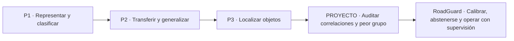
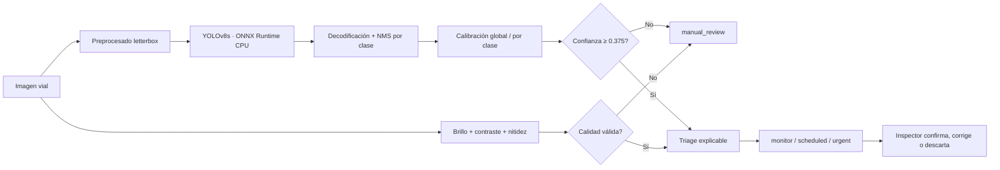

## Executive summary

RoadGuard is the professional culmination of a trajectory that began with image classification, continued with transfer learning and data augmentation, went through object detection, and arrived at robustness and bias analysis. This new project does not repeat the Waterbirds experiment nor present a downloaded detector as if it were a proprietary model. It formulates a different problem, one closer to production:

> When can a road damage detection enter an inspection queue, and when should the system abstain because the country, the class, or the image quality make its confidence unreliable?

RoadGuard combines:

- a pretrained YOLOv8s detector in ONNX format;
- official RDD2022 data from China (MotorBike) and the United States;
- separate evaluation by country and visual degradation;
- global and per-class confidence calibration;
- a selective policy of acceptance or abstention;
- a quality gate for dark or blurry images;
- explainable triage to prioritize human review;
- cryptographic verification of artifacts and local CPU execution.

### Main result

| Indicator | Raw policy | Calibrated policy | Interpretation |
|---|---:|---:|---|
| ECE on clean images | 0.089 | 0.029 | relative reduction of 67.5% |
| F1 of the worst country | 0.699 | 0.707 | small improvement in the worst case |
| Human review under all conditions | — | 45.5% | deliberate abstention in the face of risk |
| Evidence processed | — | 360 images / 792 inferences | 2 countries and 3 conditions |

Calibration improves the correspondence between confidence and hit frequency, but **it does not improve F1 uniformly**. The paired per-image bootstrap estimates:

- China: ΔF1 = **−0.015**, 95% CI **[−0.028, −0.003]**.
- United States: ΔF1 = **+0.009**, 95% CI **[−0.005, +0.026]**.

The most important finding was one of ontology, not visual capability. The ONNX model and its metadata call channel 3 `Pothole` and channel 4 `Other`, but in the calibration split channel 4 overlaps 20/20 Chinese potholes and channel 3 overlaps 32/33 `Repair/Other` regions. The 3↔4 permutation was fixed using only calibration data and was explicitly logged before regenerating evaluation. With the correct correspondence, `Pothole` reaches AP50 = 0.988 in China and 0.683 in the United States. This episode demonstrates that weighting a supposed "worst class" before auditing labels can optimize the wrong problem.

## 1. Statement of integrity and authorship

This report separates three types of evidence:

1. **Results demonstrated by previous files.** Only metrics present in the notebooks or reports are cited.
2. **Knowledge introduced by an exercise.** An incomplete guide or code can demonstrate curricular intent, but not an experimental result.
3. **RoadGuard's new contribution.** Problem design, artifact security, pipeline implementation, cross-domain protocol, calibration, abstention, triage, evaluation, bootstrap, and critical analysis.

The base detector was not trained in this project. It is a pretrained component attributed to its author. Presenting it otherwise would be incorrect. The genuine contribution is turning that component into an evaluable, conservative system.

### What is not claimed

- No proprietary results are attributed to P1, since the preserved file is the assignment guide.
- P3 is not claimed to be a finished detector: `single_stage_detector.py` still contains `TODO` and `pass`.
- Good aggregate F1 is not claimed to imply uniform robustness across countries or conditions.
- Country is not interpreted as a protected group, nor is "worst country" treated as a demographic fairness measure.
- A visual box is not turned into a structural diagnosis.

## 2. From the archive to professional judgment

Reviewing `p1`, `ARBELAEZ_JOSE_P2`, `ARBELAEZ_JOSE_P3`, `PROYECTO`, and `Teoria` produces a clear evolution:



| Stage | Evidence found | Competency | Acknowledged limit |
|---|---|---|---|
| P1 | PR1.1 guide on CNNs, AlexNet, and ResNet | classification formulation and evaluation | no verifiable proprietary results in the file |
| P2 | notebooks and report with four strategies | transfer learning and augmentation with empirical comparison | adding more transformations does not guarantee generalization |
| P3 | notebook and `single_stage_detector.py` | boxes, IoU, offsets, confidence, and NMS | incomplete implementation |
| PROYECTO | Waterbirds, ResNet/DINO, worst group, and Grad-CAM | spurious correlations, ID/OOD, and group analysis | already-explored academic problem; repeating it was not a sufficient next step |
| RoadGuard | code, verified ONNX, reproducible sample, and results | selective reliability, security, domain shift, and human-in-the-loop | does not replace structural inspection nor cover all regions |

### 2.1 P1 — learning to formulate classification

P1 introduces the course's basic unit: an image enters a convolutional architecture and produces a category. Its value in the portfolio is curricular. It establishes the questions about data partitioning, representation, optimization, and evaluation. This report does not invent accuracy figures or curves, since the archived material corresponds to the assignment.

### 2.2 P2 — from training from scratch to transfer

P2 contains a complete experimental history:

| Strategy | Recorded result | Lesson |
|---|---:|---|
| CNN from scratch | maximum 0.775; last epoch 0.755 | a network can learn the training set without generalizing well |
| Pretrained representations + SVM | 0.880 | transferable features reduce the cost of learning |
| Fine-tuning without augmentation | 0.915 | adapting the representation to the domain matters |
| Fine-tuning with augmentation | 0.940 | useful variation can improve robustness |

The augmentation experiment provides an even more important lesson:

| Transformation | Result |
|---|---:|
| baseline | 75.97% |
| horizontal flip | 79.01% |
| random crop | **79.38%** |
| flip + crop | 78.95% |
| rotation | 76.53% |
| random erasing | 78.44% |
| color jitter | 76.45% |
| all combined | **71.19%** |

The most complex combination was the worst. The lesson carried over to RoadGuard is that a transformation must represent a hypothesis about the environment. `dark` and `blur` are explicit stress tests; they are not added to "make more data" without a scientific question.

### 2.3 P3 — localizing and confronting technical debt

P3 changes the problem: a prediction must include class, box, and confidence. IoU, foreground/background, offset regression, and NMS appear. However, the code retains unimplemented parts. The evidence demonstrates partial understanding of the single-stage detector, not a finished solution.

RoadGuard turns that limitation into an honest engineering decision: use a verifiable pretrained detector and dedicate new work to problems P3 did not solve:

- cross-domain transfer;
- per-class evaluation;
- confidence calibration;
- rejection of unsafe predictions;
- visual quality control;
- operation with a human in the loop.

### 2.4 PROYECTO — from accuracy to worst group

Waterbirds demonstrates that a global metric can hide the worst subgroup.

| Model | ID global | ID worst group | OOD global | OOD worst group |
|---|---:|---:|---:|---:|
| Original ResNet | 0.862 | 0.608 | 0.810 | 0.541 |
| Adapted ResNet | 0.925 | 0.801 | 0.889 | 0.773 |
| Standard DINO | 0.819 | 0.626 | 0.837 | 0.642 |
| Adapted DINO | 0.913 | 0.852 | 0.919 | 0.810 |

The lesson is not "re-audit Waterbirds." It is adopting the principle that the worst case matters and carrying it into another problem. RoadGuard uses country as the robustness domain and adds an operational response: when the evidence is insufficient, the system abstains.

## 3. Selected theoretical framework

From `Teoria`, the concepts directly related to the new problem were chosen.

| Concept | Operational idea | Implemented decision |
|---|---|---|
| IoU, precision–recall, and AP | accuracy does not measure localization or false alarms | per-class match + IoU ≥ 0.50; AP50, P/R/F1 |
| NMS | overlapping boxes compete and the threshold affects recall | explicit per-class NMS |
| Domain shift | a model trained in one domain can degrade in another | separate report by country and worst domain |
| Adaptation with few target labels | a small sample can adjust a decision layer | calibrator learned with 72 images per country |
| Explainability and auditing | documenting data, decisions, limits, and lifecycle | manifest, hashes, complete tables, and failure analysis |
| Human oversight | a person needs context and authority to intervene | `manual_review`, reasons, and non-binding priority |
| Accuracy and safety | reliability is a system property | quality gate, abstention, and artifact verification |

### Calibration

A confidence of 0.90 does not automatically mean that nine out of ten detections are correct. Calibration attempts to align confidence with the empirical hit frequency.

RoadGuard uses Platt scaling on the logit of the raw confidence:

$$
\hat{p}(y=1\mid s,c) = \sigma\!\left(a_c\operatorname{logit}(s)+b_c\right)
$$

where `s` is the confidence, `c` the class, and the per-class parameters are estimated only on calibration. If a class contains enough observations but all of them are errors, a constant probability with Laplace smoothing is used. This is a conservative response to negative evidence, not a correction of the boxes.

### Selective classification

The policy does not force the model to always decide:

$$
g(x)=
\begin{cases}
\text{accept}, & \hat{p}\ge \tau \land q(x)=1,\\
\text{manual review}, & \text{otherwise}.
\end{cases}
$$

The threshold `τ = 0.375` was chosen on calibration as the best F1 among candidates with a minimum precision of 0.75. The evaluation set plays no part in this selection.

> **Important distinction.** "Worst country" is a domain robustness measure. It is not a demographic fairness measure; a fairness evaluation would require social variables and an appropriate framework.

## 4. Problem, objective, and questions

### Problem

Road networks generate too many images for exhaustive manual review. A detector can prioritize evidence, but:

- a false alarm consumes time and budget;
- a false negative can hide deterioration;
- camera, pavement, weather, and signage vary between countries;
- overestimated confidence can seem more useful than it actually is.

### General objective

Design and evaluate a local, reproducible, conservative system that detects road damage, calibrates confidence outside the training domain, and routes unsafe predictions to human review.

### Research questions

- **RQ1.** Does calibration reduce the Expected Calibration Error on clean images?
- **RQ2.** Does a calibrated policy improve the worst country's F1 compared to the raw threshold?
- **RQ3.** Which visual degradation produces the greatest operational risk?
- **RQ4.** Which classes prevent autonomous deployment, and how should the system respond?

### Hypotheses

- **H1.** Calibration will reduce ECE without using evaluation data to choose parameters.
- **H2.** Selective rejection will increase precision and F1 in both countries, at the cost of coverage.
- **H3.** `blur` will cause more recall loss than a moderate reduction in illumination.
- **H4.** Classes with poor transfer will require per-class abstention, not an optimistic global threshold.

## 5. RoadGuard architecture



### Components

1. `data.py`: ZIP audit, VOC parsing, deterministic sampling, and image quality.
2. `detector.py`: ONNX loading, letterbox, YOLO decoding, and NMS.
3. `metrics.py`: IoU, matching, AP50, ECE, and per-policy metrics.
4. `calibration.py`: global and per-class Platt scaling with conservative fallback.
5. `triage.py`: acceptance, review, and advisory priority.
6. `visualize.py`: reliability, policy comparison, stress testing, and examples.
7. `run_experiment.py`: complete protocol and reproducible artifacts.

## 6. Model, data, and security

### Model

`vinothvikas1987/pothole-detection-yolov8` was chosen, fixed commit `b001687443175e43442f63bef4691c3546629def`.

| Property | Value |
|---|---|
| format | ONNX, not Pickle |
| size | 44.8 MB |
| input | `[1, 3, 640, 640]` |
| output | `[1, 9, 8400]` |
| graph | IR 9, 231 nodes, validated with `onnx.checker` |
| runtime | ONNX Runtime CPU |
| classes | longitudinal, transverse, alligator, pothole, other |
| SHA-256 | `590A20E8C4A7BCBDB32E8A3B7B3A3C1D57D1FA8A7DDE5C83FCEC8928A4AA753F` |

No `.pt`/`.pkl` weights were downloaded. ONNX does not eliminate all supply-chain risks, but it avoids executing a serialized Python object when loading the model. The hash pins exactly the evaluated artifact.

### Laptop compatibility

| Resource | Evidence |
|---|---|
| CPU | Intel Core Ultra 7 155H |
| RAM | 31.6 GB |
| GPU | integrated Intel Arc; not needed for the protocol |
| execution | 792 inferences in ~108 s of compute |
| observed throughput | approximately 7.4 images/s |

The project avoids depending on CUDA. It can be reproduced on the laptop with ample memory and storage.

### Data

Official RDD2022 files were used:

| Artifact | Size | SHA-256 |
|---|---:|---|
| China MotorBike ZIP | 192,030,116 bytes | `2ACDC8B8527C9B36CCE4BA97DFDD5BE9090BE32F588C31B769A08C1A41C0C274` |
| United States ZIP | 444,335,958 bytes | `597E8BCF1FFBE80D6C8295FBF99EBAB5651C9E4EFE961F9D38A9ED4AD10B957E` |

Before extraction it was verified that entries were images/XML only and did not contain absolute paths or `..`.

### Split

| Country | Calibration | Evaluation | Evaluation conditions |
|---|---:|---:|---|
| China · MotorBike | 72 | 108 | clean, dark, blur |
| United States | 72 | 108 | clean, dark, blur |

Total: 360 distinct images. Each evaluation image is processed under three conditions, but these transformations are not treated as independent samples.

## 7. Experimental protocol

### Variables

- Independent unit for statistical inference: **image**.
- True positive: same class and IoU ≥ 0.50 with an unmatched annotation.
- Base policy: `confidence ≥ 0.25`.
- Calibrated policy: `calibrated_confidence ≥ 0.375`.
- Conditions: `clean`, `dark` and `blur`.
- Sampling and bootstrap seed: 2026.

### Metrics

- precision, recall and F1;
- AP50 per class;
- Expected Calibration Error with 10 bins;
- worst F1 across countries;
- referral rate to human review;
- 95% CI with 2,000 bootstrap resamples per image.

Localization is evaluated with intersection over union:

$$
\operatorname{IoU}(B_p,B_g)
=
\frac{|B_p\cap B_g|}{|B_p\cup B_g|}.
$$

A box is a true positive if it matches in class and satisfies $\operatorname{IoU}\ge 0.50$. From the matchings:

$$
\operatorname{Precision}=\frac{TP}{TP+FP},
\qquad
\operatorname{Recall}=\frac{TP}{TP+FN},
$$

$$
F_1=2\frac{\operatorname{Precision}\cdot\operatorname{Recall}}
{\operatorname{Precision}+\operatorname{Recall}}.
$$

Calibration is summarized via ECE. For $M=10$ confidence intervals:

$$
\operatorname{ECE}
=
\sum_{m=1}^{M}\frac{|S_m|}{n}
\left|\operatorname{acc}(S_m)-\operatorname{conf}(S_m)\right|.
$$

The bootstrap preserves the image as the independent unit. For resample $b$, the paired improvement is:

$$
\Delta F_1^{(b)} = F_{1,\mathrm{cal}}^{(b)}-F_{1,\mathrm{raw}}^{(b)},
$$

and the 95% interval uses the 2.5 and 97.5 percentiles of the 2,000 replicates.

### Leakage control

The calibrator and the threshold are fit exclusively on the 144 calibration images. The 216 evaluation images do not modify any parameter.

### Triage

Priority combines class, relative area and calibrated confidence:

- `monitor`: accepted low-priority signal;
- `scheduled`: include in a scheduled inspection;
- `urgent`: review soon;
- `manual_review`: insufficient automatic evidence.

These labels organize work. They do not estimate depth nor authorize a road action.

## 8. Results

### 8.1 Ontology audit

The first evaluation produced AP50 = 0 for `Pothole` and nearly 0 for `Other`. Before interpreting this as model incapacity, it was measured, for each annotation, whether a spatial proposal existed with IoU ≥ 0.50 ignoring class. The result showed a near-exact permutation of the last two channels.

| Evidence at calibration | Pothole | Repair / Other |
|---|---:|---:|
| China · annotations | 20 | 33 |
| Best ONNX channel 4 | 20/20 | 0/33 |
| Best ONNX channel 3 | 0/20 | 32/33 |
| United States · potholes covered | channel 4 in 13/14 | no support for `Other` |

The canonical correspondence was fixed as $m(3)=4$ and $m(4)=3$. `predictions.csv` keeps both `model_class_id` and `class_id`, and `models/class_mapping.json` documents the decision. The evaluation was not used to select the mapping.

### 8.2 Confidence reliability

<figure class="roadguard-chart" data-roadguard-chart="reliability"><div class="roadguard-chart__header"><div><span class="roadguard-chart__eyebrow">Calibration</span><h4>Confidence reliability</h4><p>Evaluation with clean images</p></div><span class="roadguard-chart__metric">ECE <strong>0.089 → 0.029</strong></span></div><div class="roadguard-chart__canvas"><canvas role="img" aria-label="Comparison between original confidence, calibrated confidence and perfect calibration"></canvas></div><figcaption>The calibrated curve is closer to the perfect-calibration diagonal.</figcaption></figure>

Clean ECE drops from **0.089** to **0.029**. Calibration brings confidence and empirical precision closer together, but this does not guarantee that a single threshold maximizes F1 across all domains.

### 8.3 Full results by country and condition

| Country | Condition | Policy | Precision | Recall | F1 |
|---|---|---|---:|---:|---:|
| China | clean | raw | **0.868** | 0.907 | **0.887** |
| China | clean | calibrated | 0.840 | 0.907 | 0.872 |
| China | dark | raw | **0.867** | **0.897** | **0.882** |
| China | dark | calibrated | 0.851 | 0.894 | 0.872 |
| China | blur | raw | 0.859 | 0.449 | 0.589 |
| China | blur | calibrated | **0.865** | **0.494** | **0.629** |
| United States | clean | raw | **0.725** | 0.674 | 0.699 |
| United States | clean | calibrated | 0.707 | **0.707** | **0.707** |
| United States | dark | raw | **0.731** | 0.656 | 0.691 |
| United States | dark | calibrated | 0.707 | **0.715** | **0.711** |
| United States | blur | raw | 0.455 | 0.148 | 0.223 |
| United States | blur | calibrated | **0.462** | **0.181** | **0.261** |

<figure class="roadguard-chart roadguard-chart--policy" data-roadguard-chart="policy"><div class="roadguard-chart__header"><div><span class="roadguard-chart__eyebrow">Selective policy</span><h4>Base policy versus calibrated policy</h4><p>Precision, recall and F1 by domain on clean images</p></div><span class="roadguard-chart__metric">Worst F1 <strong>0.699 → 0.707</strong></span></div><div class="roadguard-chart__canvas"><canvas role="img" aria-label="Comparison of precision, recall and F1 for the raw and calibrated policies in China and the United States"></canvas></div><figcaption>Calibration shifts the precision-coverage tradeoff differently in each country.</figcaption></figure>

The calibrated policy trades off precision and recall differently per domain. It helps under blur and in the United States, but reduces clean and dark F1 in China. It is therefore kept as a probabilistic-reliability policy, not as a claim of universal classification superiority.

### 8.4 Bootstrap intervals

| Country | Estimate | Mean | 95% CI |
|---|---|---:|---:|
| China | Raw F1 | 0.886 | [0.851, 0.921] |
| China | Calibrated F1 | 0.871 | [0.834, 0.906] |
| China | ΔF1 | **−0.015** | **[−0.028, −0.003]** |
| United States | Raw F1 | 0.697 | [0.642, 0.753] |
| United States | Calibrated F1 | 0.706 | [0.656, 0.759] |
| United States | ΔF1 | **+0.009** | **[−0.005, +0.026]** |

The paired interval confirms a small but consistent reduction in China; in the United States it includes zero. The correct conclusion is that calibration improves ECE and the worst domain, but the global threshold does not dominate the baseline in every country.

### 8.5 Visual stress test

<figure class="roadguard-chart roadguard-chart--stress" data-roadguard-chart="stress"><div class="roadguard-chart__header"><div><span class="roadguard-chart__eyebrow">Stress test</span><h4>Robustness against visual degradations</h4><p>F1 of the calibrated policy by country and condition</p></div><span class="roadguard-chart__metric">Minimum F1 <strong>0.261</strong></span></div><div class="roadguard-chart__canvas"><canvas role="img" aria-label="F1 of the calibrated policy with clean, dark and blurred images in China and the United States"></canvas></div><figcaption>Blur concentrates the largest loss, especially in the United States.</figcaption></figure>

`dark` barely alters the clean result. `Blur` is the main failure mode: it destroys edges and localization, so a better threshold can only protect precision, not recover lost information.

## 9. Per-class analysis and failures

### AP50 on clean images

| Country | Class | Ground truth | AP50 |
|---|---|---:|---:|
| China | Longitudinal Crack | 130 | 0.874 |
| China | Transverse Crack | 53 | 0.854 |
| China | Alligator Crack | 58 | 0.977 |
| China | Pothole | 33 | **0.988** |
| China | Other | 38 | **0.974** |
| United States | Longitudinal Crack | 130 | 0.768 |
| United States | Transverse Crack | 68 | 0.692 |
| United States | Alligator Crack | 40 | 0.878 |
| United States | Pothole | 32 | **0.683** |

After aligning the ontology, all clean classes carry useful signal. The relevant gap is one of domain: `Pothole` drops from 0.988 in China to 0.683 in the United States and to 0.179 under US blur. That difference, together with the low overall recall under blur, is the correct motivation for continual learning and group-wise robustness.

### Conservative response of the calibrator

After the mapping, the calibrator learns non-degenerate parameters for all five classes. Calibration reduces ECE, but the bootstrap analysis prevents confusing better probability with better F1 across all domains.

> **Scientific finding.** Reliability is heterogeneous by class. A global threshold hides that structure; per-class calibration turns it into a safety rule.

### Coverage and human workload

| Output | Cases | Proportion |
|---|---:|---:|
| `manual_review` | 295 | 45.5% |
| `monitor` | 192 | 29.6% |
| `scheduled` | 138 | 21.3% |
| `urgent` | 23 | 3.5% |

A high review rate is not automatically good. Here it mainly reflects deliberate blur and lower coverage of the US domain. In production, the risk–coverage curve should be optimized with real costs and local data.

## 10. Qualitative evidence

| China · MotorBike | United States |
|---|---|
|  |  |
|  |  |

Critical reading:

- the detector can fragment long damage into several boxes;
- NMS controls duplicates, but does not replace segmentation;
- the US urban scene adds vehicles, markings and perspective;
- a box's area is a visual approximation, not structural severity;
- Street View and MotorBike represent different capture pipelines.

## 11. Responsible use

RoadGuard is inspection support, not:

- vehicle control;
- civil engineering diagnosis;
- expert assessment;
- work authorization;
- automatic road closure.

`urgent` means **review with priority**, never execute an action automatically.

### Risks and controls

| Risk | Control implemented | Before production |
|---|---|---|
| false sense of safety | calibration, abstention and per-class AP | prospective local validation and cost-based threshold |
| camera or country change | per-domain reporting and stress testing | drift monitor and reference batch |
| degraded image | quality gate | request recapture and preserve metadata |
| limited coverage | two domains and explicit limits | add night, weather, regions and pavements |
| improper automation | `manual_review` and advisory priority | interface with override, reasons and audit |
| supply chain | ONNX, hash and ZIP audit | SBOM, isolated environment and license review |

### Meaningful human oversight

It is not enough to show a box and transfer all responsibility to a person. The interface should show:

- country/camera or known domain;
- visual quality;
- class and calibrated confidence;
- reason for rejection;
- model history;
- ability to correct, discard and escalate;
- log of the final decision.

Corrections should feed a relabeling and recalibration queue.

### Go / no-go criteria

- **NO-GO** for autonomous maintenance decisions, even when the visual class is correct.
- **NO-GO** if quality fails or the domain has not been validated.
- **Limited GO** to prioritize accepted damage, always with review and with the ontology mapping locked by version.
- Recalibrate if ECE, coverage or precision fall outside the agreed operational limits.

## 12. What I learned

### Technical lessons

1. Transfer learning reduces the cost of learning representations, but it also transfers assumptions from the source domain.
2. Data augmentation is a hypothesis about invariances; combining transformations can destroy the signal.
3. In detection, class, localization, duplicates and threshold form a single problem.
4. An apparently failed class can be an ontology error; labels must be audited before changing the loss.
5. Calibration does not fix boxes; it fixes how their confidence is interpreted.
6. Abstention turns uncertainty into an interface between model and person.

### Scientific lessons

1. Separating calibration and evaluation avoids choosing the result after observing it.
2. Intervals must respect the independent unit: here, the image.
3. A localized, reproducible failure is more informative than a global figure without diagnosis.
4. The conclusion must be proportional to the evidence: two countries do not represent the world.
5. Error analysis can change the legitimate scope of the product.

### Professional lessons

1. Verifying format, hash and provenance is part of building applied AI.
2. Documenting what is incomplete increases credibility.
3. A responsible system defines what it must not do before demonstrating what it can do.
4. A person must have real information and authority, not be a decorative "ethical layer."

> The full evolution can be summarized like this: I went from asking "what accuracy do I get?" to asking "under what conditions, for whom and with what recovery mechanism can I trust this output?"

## 13. Conclusions and next stage

RoadGuard integrates classification, transfer, augmentation, detection, robustness and auditing into an executable system. Calibration reduces ECE, though its global threshold does not improve F1 in every domain. Stress testing identifies blur as a threat, and the audit uncovers a silent class permutation that would have produced a false conclusion about `Pothole`.

The next scientific step is not to download a bigger model. It is:

1. lock and verify the correspondence between model channels and target ontology;
2. continually learn from US cases, blur and human corrections;
3. measure forgetting after each adaptation episode;
4. compare SVM, prototypes and a metric head with replay;
5. apply worst-group optimization only after auditing labels;
6. study risk–coverage curves and conformal prediction by domain;
7. adapt the detector if the spatial proposal, not the class, limits recall.

### Roadmap

The full continuation methodology is in [`FASE_II_APRENDIZAJE_CONTINUO.md`](FASE_II_APRENDIZAJE_CONTINUO.md). It is presented as a pre-registration: it defines decisions and criteria before training, without attributing results that do not yet exist.

| Phase | Question | Exit criterion |
|---|---|---|
| target data | do the labels mean the same thing? | inter-annotator agreement and datasheet |
| adaptation | do few examples recover pothole? | AP50/recall with CI per country |
| calibration | is risk reduced with better coverage? | risk–coverage curve and expected cost |
| pilot | does it help the inspector without overloading them? | time, override and false negatives |
| operation | does it remain stable? | drift monitor and rollback plan |

## 14. Reproducibility

### Structure

```text
ARBELAEZ_JOSE_CAPSTONE_ROADGUARD/
├── MEMORIA_PORTAFOLIO.md
├── README.md
├── SECURITY_AND_PROVENANCE.md
├── data/
│   ├── raw/
│   └── sample/manifest.csv
├── docs/EXPERIMENT_PROTOCOL.md
├── models/road_distress_yolov8s.onnx
├── outputs/
│   ├── figures/
│   └── tables/
├── scripts/
│   ├── demo.py
│   ├── prepare_sample.py
│   ├── run_experiment.py
│   └── verify_artifacts.py
├── src/roadguard/
└── tests/test_core.py
```

### Execution

```powershell
python -m venv .venv
.\.venv\Scripts\python -m pip install -r requirements.txt
.\.venv\Scripts\python scripts\verify_artifacts.py
.\.venv\Scripts\python scripts\prepare_sample.py
.\.venv\Scripts\python scripts\run_experiment.py
.\.venv\Scripts\python -m pytest -q
```

Demo on a single image:

```powershell
.\.venv\Scripts\python scripts\demo.py ruta\a\imagen.jpg
```

### Auditable outputs

| File | Use |
|---|---|
| `predictions.csv` | box, class, confidence and correctness per prediction |
| `image_results.csv` | ground truth, condition and quality per image |
| `summary_metrics.csv` | P/R/F1 by country, condition and policy |
| `per_class_ap.csv` | AP50 and support per class |
| `bootstrap_f1.csv` | confidence intervals by country |
| `calibrator.json` | learned parameters |
| `triage_results.csv` | acceptance, reason and priority |
| `experiment_summary.json` | machine-readable summary |

The automated tests cover IoU/matching, calibration and triage. The current result is **4 tests passed**.

## 15. References

### Course material

1. `2025_VAAP_2_1_object_detection_print_annotated.pdf`: IoU, precision–recall, AP/mAP and NMS.
2. `[NOTES] 2025_VAAP_4_domain_adaptation_basic.pdf`: domain shift and adaptation with target labels.
3. `[NOTES 64-END] 2025_VAAP_5_interpretabilidad_bias.pdf`: explainability, datasheets and model auditing.
4. `[NOTES]2025_VAAP_5_EU_AI_Act.pdf`: risk-based approach, human oversight, accuracy and safety.

### External sources

1. Arya, D. et al. (2022). *RDD2022: A Multi-national Image Dataset for Automatic Road Damage Detection*. arXiv:2209.08538.
2. Guo, C., Pleiss, G., Sun, Y. & Weinberger, K. (2017). *On Calibration of Modern Neural Networks*. ICML.
3. Davis, J. & Goadrich, M. (2006). *The Relationship Between Precision-Recall and ROC Curves*. ICML.
4. Geifman, Y. & El-Yaniv, R. (2017). *Selective Classification for Deep Neural Networks*. NeurIPS.
5. Sekilab. [RoadDamageDetector / RDD2022](https://github.com/sekilab/RoadDamageDetector).
6. Hugging Face. [Model card: pothole-detection-yolov8](https://huggingface.co/vinothvikas1987/pothole-detection-yolov8).
7. European Union. Regulation (EU) 2024/1689 laying down harmonised rules on artificial intelligence.

## Final statement

The base detector and RDD2022 are attributed to their authors. The experimental design, safe artifact selection, inference and postprocessing implementation, calibration, abstention, quality gate, triage, metrics, bootstrap, visualizations, critical analysis and this write-up constitute RoadGuard's integrative work.
