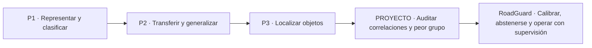
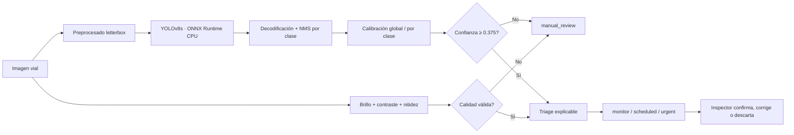

# RoadGuard

## Resumen ejecutivo

RoadGuard es el cierre profesional de una trayectoria que comenzó con clasificación de imágenes, continuó con transfer learning y data augmentation, pasó por detección de objetos y llegó al análisis de robustez y sesgo. El nuevo proyecto no repite el experimento de Waterbirds ni presenta un detector descargado como si fuera un modelo propio. Formula un problema distinto y más cercano a producción:

> ¿Cuándo puede una detección de daño vial entrar en una cola de inspección y cuándo debe el sistema abstenerse porque el país, la clase o la calidad de imagen hacen que su confianza no sea fiable?

RoadGuard combina:

- un detector YOLOv8s preentrenado en formato ONNX;
- datos oficiales RDD2022 de China (MotorBike) y Estados Unidos;
- evaluación separada por país y degradación visual;
- calibración de confianza global y por clase;
- una política selectiva de aceptación o abstención;
- una compuerta de calidad para imágenes oscuras o desenfocadas;
- triage explicable para priorizar revisión humana;
- verificación criptográfica de los artefactos y ejecución local en CPU.

### Resultado principal

| Indicador | Política cruda | Política calibrada | Lectura |
|---|---:|---:|---|
| ECE en imágenes limpias | 0.089 | 0.029 | reducción relativa del 67.5% |
| F1 del peor país | 0.699 | 0.707 | mejora pequeña del caso peor |
| Revisión humana bajo todas las condiciones | — | 45.5% | abstención deliberada ante riesgo |
| Evidencia procesada | — | 360 imágenes / 792 inferencias | 2 países y 3 condiciones |

La calibración mejora la correspondencia entre confianza y frecuencia de acierto, pero **no mejora F1 de forma uniforme**. El bootstrap pareado por imagen estima:

- China: ΔF1 = **−0.015**, IC 95% **[−0.028, −0.003]**.
- Estados Unidos: ΔF1 = **+0.009**, IC 95% **[−0.005, +0.026]**.

El hallazgo más importante fue de ontología, no de capacidad visual. El ONNX y su metadata llaman `Pothole` al canal 3 y `Other` al 4, pero en la partición de calibración el canal 4 solapa 20/20 potholes chinos y el canal 3 solapa 32/33 regiones `Repair/Other`. La permutación 3↔4 se fijó usando solo calibración y se registró explícitamente antes de regenerar evaluación. Con la correspondencia correcta, `Pothole` alcanza AP50 = 0.988 en China y 0.683 en Estados Unidos. Este episodio demuestra que ponderar una supuesta «peor clase» antes de auditar etiquetas puede optimizar el problema equivocado.

## 1. Declaración de integridad y autoría

Esta memoria separa tres tipos de evidencia:

1. **Resultados demostrados por los archivos anteriores.** Solo se citan métricas presentes en los notebooks o informes.
2. **Conocimientos introducidos por una práctica.** Una guía o código incompleto puede demostrar intención curricular, pero no un resultado experimental.
3. **Contribución nueva de RoadGuard.** Diseño del problema, seguridad del artefacto, implementación del pipeline, protocolo cross-domain, calibración, abstención, triage, evaluación, bootstrap y análisis crítico.

El detector base no fue entrenado en este proyecto. Es un componente preentrenado atribuido a su autor. Presentarlo de otra forma sería incorrecto. El aporte propio es convertir ese componente en un sistema evaluable y conservador.

### Qué no se afirma

- No se atribuyen resultados propios a P1 porque el archivo conservado es la guía de la práctica.
- No se afirma que P3 sea un detector terminado: `single_stage_detector.py` todavía contiene `TODO` y `pass`.
- No se afirma que el buen F1 agregado implique robustez uniforme entre países o condiciones.
- No se interpreta país como grupo protegido ni “peor país” como una medida de fairness demográfica.
- No se convierte una caja visual en un diagnóstico estructural.

## 2. Del archivo al criterio profesional

La revisión de `p1`, `ARBELAEZ_JOSE_P2`, `ARBELAEZ_JOSE_P3`, `PROYECTO` y `Teoria` produce una evolución clara:



| Etapa | Evidencia encontrada | Competencia | Límite reconocido |
|---|---|---|---|
| P1 | guía PR1.1 sobre CNN, AlexNet y ResNet | formulación de clasificación y evaluación | no hay resultados propios verificables en el archivo |
| P2 | notebooks e informe con cuatro estrategias | transfer learning y augmentation con comparación empírica | aumentar transformaciones no garantiza generalización |
| P3 | notebook y `single_stage_detector.py` | cajas, IoU, offsets, confianza y NMS | implementación incompleta |
| PROYECTO | Waterbirds, ResNet/DINO, peor grupo y Grad-CAM | correlaciones espurias, ID/OOD y análisis por grupo | problema académico ya explorado; repetirlo no era un siguiente paso suficiente |
| RoadGuard | código, ONNX verificado, muestra reproducible y resultados | fiabilidad selectiva, seguridad, domain shift y human-in-the-loop | no sustituye inspección estructural ni cubre todas las regiones |

### 2.1 P1 — aprender a formular clasificación

P1 introduce la unidad básica del curso: una imagen entra en una arquitectura convolucional y produce una categoría. Su valor en el portafolio es curricular. Establece las preguntas sobre partición de datos, representación, optimización y evaluación. La memoria no inventa accuracy ni curvas porque el material archivado corresponde a la consigna.

### 2.2 P2 — del entrenamiento desde cero a la transferencia

P2 contiene una historia experimental completa:

| Estrategia | Resultado registrado | Aprendizaje |
|---|---:|---|
| CNN desde cero | máximo 0.775; última época 0.755 | una red puede aprender el conjunto sin generalizar bien |
| Representaciones preentrenadas + SVM | 0.880 | las características transferibles reducen el coste de aprender |
| Fine-tuning sin augmentation | 0.915 | adaptar la representación al dominio es importante |
| Fine-tuning con augmentation | 0.940 | la variación útil puede mejorar robustez |

El experimento de augmentation aporta una lección todavía más importante:

| Transformación | Resultado |
|---|---:|
| baseline | 75.97% |
| horizontal flip | 79.01% |
| random crop | **79.38%** |
| flip + crop | 78.95% |
| rotation | 76.53% |
| random erasing | 78.44% |
| color jitter | 76.45% |
| todas combinadas | **71.19%** |

La combinación más compleja fue la peor. La conclusión transferida a RoadGuard es que una transformación debe representar una hipótesis sobre el entorno. `dark` y `blur` son pruebas de estrés explícitas; no se añaden para “hacer más data” sin una pregunta científica.

### 2.3 P3 — localizar y reconocer deuda técnica

P3 cambia el problema: una predicción debe incluir clase, caja y confianza. Aparecen IoU, foreground/background, regresión de offsets y NMS. Sin embargo, el código conserva partes sin implementar. La evidencia demuestra comprensión parcial del detector de una etapa, no una solución terminada.

RoadGuard convierte esa limitación en una decisión honesta de ingeniería: usar un detector preentrenado verificable y dedicar el trabajo nuevo a problemas que P3 no resolvía:

- transferencia entre dominios;
- evaluación por clase;
- calibración de confianza;
- rechazo de predicciones inseguras;
- control de calidad visual;
- operación con una persona en el circuito.

### 2.4 PROYECTO — de accuracy a peor grupo

Waterbirds demuestra que una métrica global puede ocultar el peor subgrupo.

| Modelo | ID global | ID peor grupo | OOD global | OOD peor grupo |
|---|---:|---:|---:|---:|
| ResNet original | 0.862 | 0.608 | 0.810 | 0.541 |
| ResNet adaptado | 0.925 | 0.801 | 0.889 | 0.773 |
| DINO estándar | 0.819 | 0.626 | 0.837 | 0.642 |
| DINO adaptado | 0.913 | 0.852 | 0.919 | 0.810 |

El aprendizaje no es “volver a auditar Waterbirds”. Es adoptar el principio de que el caso peor importa y llevarlo a otro problema. RoadGuard usa país como dominio de robustez y añade una respuesta operacional: cuando la evidencia es insuficiente, el sistema se abstiene.

## 3. Marco teórico seleccionado

De `Teoria` se eligieron los conceptos directamente relacionados con el nuevo problema.

| Concepto | Idea operativa | Decisión implementada |
|---|---|---|
| IoU, precision–recall y AP | accuracy no mide localización ni falsas alarmas | match por clase + IoU ≥ 0.50; AP50, P/R/F1 |
| NMS | cajas solapadas compiten y el umbral afecta recall | NMS explícito por clase |
| Domain shift | un modelo entrenado en un dominio puede degradarse en otro | reporte separado por país y peor dominio |
| Adaptación con pocas etiquetas target | una muestra pequeña puede ajustar una capa de decisión | calibrador aprendido con 72 imágenes por país |
| Explainability y auditoría | documentar datos, decisiones, límites y ciclo de vida | manifiesto, hashes, tablas completas y análisis de fallos |
| Human oversight | una persona necesita contexto y autoridad para intervenir | `manual_review`, razones y prioridad no vinculante |
| Exactitud y seguridad | la fiabilidad es una propiedad de sistema | quality gate, abstención y verificación del artefacto |

### Calibración

Una confianza de 0.90 no significa automáticamente que nueve de cada diez detecciones sean correctas. La calibración intenta alinear confianza con frecuencia empírica de acierto.

RoadGuard utiliza Platt scaling sobre el logit de la confianza cruda:

$$
\hat{p}(y=1\mid s,c) = \sigma\!\left(a_c\operatorname{logit}(s)+b_c\right)
$$

donde `s` es la confianza, `c` la clase y los parámetros por clase se estiman solo en calibración. Si una clase contiene suficientes observaciones pero todas son errores, se usa una probabilidad constante con suavizado de Laplace. Es una respuesta conservadora a evidencia negativa, no una corrección de las cajas.

### Clasificación selectiva

La política no obliga al modelo a decidir siempre:

$$
g(x)=
\begin{cases}
\text{aceptar}, & \hat{p}\ge \tau \land q(x)=1,\\
\text{revisión manual}, & \text{en otro caso}.
\end{cases}
$$

El umbral `τ = 0.375` se eligió en calibración como el mejor F1 entre candidatos con precisión mínima de 0.75. El conjunto de evaluación no interviene en esta selección.

> **Distinción importante.** “Peor país” es una medida de robustez de dominio. No es una medida de equidad demográfica; una evaluación de fairness necesitaría variables sociales y un marco apropiado.

## 4. Problema, objetivo y preguntas

### Problema

Las redes viales generan demasiadas imágenes para una revisión manual exhaustiva. Un detector puede priorizar evidencias, pero:

- una falsa alarma consume tiempo y presupuesto;
- un falso negativo puede ocultar deterioro;
- la cámara, el pavimento, el clima y la señalización cambian entre países;
- una confianza sobreestimada puede parecer más útil de lo que realmente es.

### Objetivo general

Diseñar y evaluar un sistema local, reproducible y conservador que detecte daños viales, calibre la confianza fuera del dominio de entrenamiento y derive predicciones inseguras a revisión humana.

### Preguntas de investigación

- **RQ1.** ¿Reduce la calibración el Expected Calibration Error en imágenes limpias?
- **RQ2.** ¿Mejora una política calibrada el F1 del peor país frente al umbral crudo?
- **RQ3.** ¿Qué degradación visual produce el mayor riesgo operacional?
- **RQ4.** ¿Qué clases impiden un despliegue autónomo y cómo debe responder el sistema?

### Hipótesis

- **H1.** La calibración reducirá ECE sin usar evaluación para elegir parámetros.
- **H2.** El rechazo selectivo aumentará precisión y F1 en ambos países, a costa de cobertura.
- **H3.** `blur` causará más pérdida de recall que una reducción moderada de iluminación.
- **H4.** Las clases con poca transferencia exigirán abstención por clase, no un umbral global optimista.

## 5. Arquitectura de RoadGuard



### Componentes

1. `data.py`: auditoría del ZIP, parsing VOC, muestreo determinista y calidad de imagen.
2. `detector.py`: carga ONNX, letterbox, decodificación YOLO y NMS.
3. `metrics.py`: IoU, matching, AP50, ECE y métricas por política.
4. `calibration.py`: Platt scaling global y por clase con fallback conservador.
5. `triage.py`: aceptación, revisión y prioridad advisory.
6. `visualize.py`: fiabilidad, comparación de políticas, estrés y ejemplos.
7. `run_experiment.py`: protocolo completo y artefactos reproducibles.

## 6. Modelo, datos y seguridad

### Modelo

Se eligió `vinothvikas1987/pothole-detection-yolov8`, commit fijo `b001687443175e43442f63bef4691c3546629def`.

| Propiedad | Valor |
|---|---|
| formato | ONNX, no Pickle |
| tamaño | 44.8 MB |
| entrada | `[1, 3, 640, 640]` |
| salida | `[1, 9, 8400]` |
| grafo | IR 9, 231 nodos, validado con `onnx.checker` |
| runtime | ONNX Runtime CPU |
| clases | longitudinal, transverse, alligator, pothole, other |
| SHA-256 | `590A20E8C4A7BCBDB32E8A3B7B3A3C1D57D1FA8A7DDE5C83FCEC8928A4AA753F` |

No se descargaron pesos `.pt`/`.pkl`. ONNX no elimina todos los riesgos de una cadena de suministro, pero evita ejecutar un objeto Python serializado al cargar el modelo. El hash fija exactamente el artefacto evaluado.

### Compatibilidad con el portátil

| Recurso | Evidencia |
|---|---|
| CPU | Intel Core Ultra 7 155H |
| RAM | 31.6 GB |
| GPU | Intel Arc integrada; no necesaria para el protocolo |
| ejecución | 792 inferencias en ~108 s de cómputo |
| rendimiento observado | aproximadamente 7.4 imágenes/s |

El proyecto evita depender de CUDA. Puede reproducirse en el portátil con memoria y almacenamiento holgados.

### Datos

Se usaron archivos oficiales RDD2022:

| Artefacto | Tamaño | SHA-256 |
|---|---:|---|
| China MotorBike ZIP | 192,030,116 bytes | `2ACDC8B8527C9B36CCE4BA97DFDD5BE9090BE32F588C31B769A08C1A41C0C274` |
| United States ZIP | 444,335,958 bytes | `597E8BCF1FFBE80D6C8295FBF99EBAB5651C9E4EFE961F9D38A9ED4AD10B957E` |

Antes de extraer se comprobó que las entradas fueran únicamente imágenes/XML y que no contuvieran rutas absolutas ni `..`.

### Partición

| País | Calibración | Evaluación | Condiciones de evaluación |
|---|---:|---:|---|
| China · MotorBike | 72 | 108 | clean, dark, blur |
| Estados Unidos | 72 | 108 | clean, dark, blur |

Total: 360 imágenes distintas. Cada imagen de evaluación se procesa en tres condiciones, pero esas transformaciones no se tratan como muestras independientes.

## 7. Protocolo experimental

### Variables

- Unidad independiente para inferencia estadística: **imagen**.
- Verdadero positivo: misma clase e IoU ≥ 0.50 con una anotación no emparejada.
- Política base: `confidence ≥ 0.25`.
- Política calibrada: `calibrated_confidence ≥ 0.375`.
- Condiciones: `clean`, `dark` y `blur`.
- Semilla de muestreo y bootstrap: 2026.

### Métricas

- precision, recall y F1;
- AP50 por clase;
- Expected Calibration Error con 10 bins;
- peor F1 entre países;
- tasa de derivación a revisión humana;
- IC 95% con 2,000 remuestreos bootstrap por imagen.

La localización se evalúa con intersección sobre unión:

$$
\operatorname{IoU}(B_p,B_g)
=
\frac{|B_p\cap B_g|}{|B_p\cup B_g|}.
$$

Una caja es verdadero positivo si coincide en clase y cumple $\operatorname{IoU}\ge 0.50$. A partir de los emparejamientos:

$$
\operatorname{Precision}=\frac{TP}{TP+FP},
\qquad
\operatorname{Recall}=\frac{TP}{TP+FN},
$$

$$
F_1=2\frac{\operatorname{Precision}\cdot\operatorname{Recall}}
{\operatorname{Precision}+\operatorname{Recall}}.
$$

La calibración se resume mediante ECE. Para $M=10$ intervalos de confianza:

$$
\operatorname{ECE}
=
\sum_{m=1}^{M}\frac{|S_m|}{n}
\left|\operatorname{acc}(S_m)-\operatorname{conf}(S_m)\right|.
$$

El bootstrap conserva la imagen como unidad independiente. Para el remuestreo $b$, la mejora pareada es:

$$
\Delta F_1^{(b)} = F_{1,\mathrm{cal}}^{(b)}-F_{1,\mathrm{raw}}^{(b)},
$$

y el intervalo del 95% usa los percentiles 2.5 y 97.5 de las 2,000 réplicas.

### Control contra leakage

El calibrador y el umbral se ajustan exclusivamente con las 144 imágenes de calibración. Las 216 imágenes de evaluación no modifican ningún parámetro.

### Triage

La prioridad combina clase, área relativa y confianza calibrada:

- `monitor`: señal aceptada de prioridad baja;
- `scheduled`: incluir en una inspección programada;
- `urgent`: revisar pronto;
- `manual_review`: no hay evidencia automática suficiente.

Estas etiquetas organizan trabajo. No estiman profundidad ni autorizan una acción vial.

## 8. Resultados

### 8.1 Auditoría de ontología

La primera evaluación produjo AP50 = 0 para `Pothole` y casi 0 para `Other`. Antes de interpretarlo como incapacidad del modelo se midió, por cada anotación, si existía una propuesta espacial con IoU ≥ 0.50 ignorando la clase. El resultado mostró una permutación casi exacta de los dos últimos canales.

| Evidencia en calibración | Pothole | Repair / Other |
|---|---:|---:|
| China · anotaciones | 20 | 33 |
| Mejor canal ONNX 4 | 20/20 | 0/33 |
| Mejor canal ONNX 3 | 0/20 | 32/33 |
| Estados Unidos · potholes cubiertos | canal 4 en 13/14 | sin soporte de `Other` |

La correspondencia canónica se fijó como $m(3)=4$ y $m(4)=3$. `predictions.csv` conserva tanto `model_class_id` como `class_id`, y `models/class_mapping.json` documenta la decisión. La evaluación no se utilizó para seleccionar el mapeo.

### 8.2 Fiabilidad de la confianza

<figure class="roadguard-chart" data-roadguard-chart="reliability"><div class="roadguard-chart__header"><div><span class="roadguard-chart__eyebrow">Calibración</span><h4>Fiabilidad de la confianza</h4><p>Evaluación con imágenes limpias</p></div><span class="roadguard-chart__metric">ECE <strong>0.089 → 0.029</strong></span></div><div class="roadguard-chart__canvas"><canvas role="img" aria-label="Comparación entre la confianza original, la confianza calibrada y la calibración perfecta"></canvas></div><figcaption>La curva calibrada se aproxima más a la diagonal de calibración perfecta.</figcaption></figure>

El ECE limpio disminuye de **0.089** a **0.029**. La calibración aproxima confianza y precisión empírica, pero esto no garantiza que un único umbral maximice F1 en todos los dominios.

### 8.3 Resultados completos por país y condición

| País | Condición | Política | Precision | Recall | F1 |
|---|---|---|---:|---:|---:|
| China | clean | cruda | **0.868** | 0.907 | **0.887** |
| China | clean | calibrada | 0.840 | 0.907 | 0.872 |
| China | dark | cruda | **0.867** | **0.897** | **0.882** |
| China | dark | calibrada | 0.851 | 0.894 | 0.872 |
| China | blur | cruda | 0.859 | 0.449 | 0.589 |
| China | blur | calibrada | **0.865** | **0.494** | **0.629** |
| Estados Unidos | clean | cruda | **0.725** | 0.674 | 0.699 |
| Estados Unidos | clean | calibrada | 0.707 | **0.707** | **0.707** |
| Estados Unidos | dark | cruda | **0.731** | 0.656 | 0.691 |
| Estados Unidos | dark | calibrada | 0.707 | **0.715** | **0.711** |
| Estados Unidos | blur | cruda | 0.455 | 0.148 | 0.223 |
| Estados Unidos | blur | calibrada | **0.462** | **0.181** | **0.261** |

<figure class="roadguard-chart roadguard-chart--policy" data-roadguard-chart="policy"><div class="roadguard-chart__header"><div><span class="roadguard-chart__eyebrow">Política selectiva</span><h4>Política base frente a política calibrada</h4><p>Precisión, recall y F1 por dominio en imágenes limpias</p></div><span class="roadguard-chart__metric">Peor F1 <strong>0.699 → 0.707</strong></span></div><div class="roadguard-chart__canvas"><canvas role="img" aria-label="Comparación de precisión, recall y F1 para las políticas cruda y calibrada en China y Estados Unidos"></canvas></div><figcaption>La calibración modifica el equilibrio entre precisión y cobertura de forma distinta en cada país.</figcaption></figure>

La política calibrada intercambia precision y recall de forma distinta por dominio. Ayuda bajo blur y en Estados Unidos, pero reduce F1 limpio y dark en China. Por tanto, se conserva como política de fiabilidad probabilística, no como una afirmación de superioridad universal en clasificación.

### 8.4 Intervalos bootstrap

| País | Estimación | Media | IC 95% |
|---|---|---:|---:|
| China | F1 crudo | 0.886 | [0.851, 0.921] |
| China | F1 calibrado | 0.871 | [0.834, 0.906] |
| China | ΔF1 | **−0.015** | **[−0.028, −0.003]** |
| Estados Unidos | F1 crudo | 0.697 | [0.642, 0.753] |
| Estados Unidos | F1 calibrado | 0.706 | [0.656, 0.759] |
| Estados Unidos | ΔF1 | **+0.009** | **[−0.005, +0.026]** |

El intervalo pareado confirma una reducción pequeña pero consistente en China; en Estados Unidos incluye cero. La conclusión correcta es que la calibración mejora ECE y el peor dominio, pero el threshold global no domina al baseline en cada país.

### 8.5 Estrés visual

<figure class="roadguard-chart roadguard-chart--stress" data-roadguard-chart="stress"><div class="roadguard-chart__header"><div><span class="roadguard-chart__eyebrow">Prueba de estrés</span><h4>Robustez ante degradaciones visuales</h4><p>F1 de la política calibrada por país y condición</p></div><span class="roadguard-chart__metric">F1 mínimo <strong>0.261</strong></span></div><div class="roadguard-chart__canvas"><canvas role="img" aria-label="F1 de la política calibrada con imágenes limpias, oscuras y desenfocadas en China y Estados Unidos"></canvas></div><figcaption>El desenfoque concentra la mayor pérdida, especialmente en Estados Unidos.</figcaption></figure>

`dark` altera poco el resultado limpio. `Blur` es el principal fallo: destruye bordes y localización, por lo que un mejor umbral solo puede proteger precisión, no recuperar la información perdida.

## 9. Análisis por clase y fallos

### AP50 en imágenes limpias

| País | Clase | Ground truth | AP50 |
|---|---|---:|---:|
| China | Longitudinal Crack | 130 | 0.874 |
| China | Transverse Crack | 53 | 0.854 |
| China | Alligator Crack | 58 | 0.977 |
| China | Pothole | 33 | **0.988** |
| China | Other | 38 | **0.974** |
| Estados Unidos | Longitudinal Crack | 130 | 0.768 |
| Estados Unidos | Transverse Crack | 68 | 0.692 |
| Estados Unidos | Alligator Crack | 40 | 0.878 |
| Estados Unidos | Pothole | 32 | **0.683** |

Después de alinear la ontología, todas las clases limpias tienen señal útil. La brecha relevante es de dominio: `Pothole` cae de 0.988 en China a 0.683 en Estados Unidos y a 0.179 bajo blur estadounidense. Esa diferencia, junto con el bajo recall general bajo blur, es la motivación correcta para aprendizaje continuo y robustez por grupo.

### Respuesta conservadora del calibrador

Después del mapeo, el calibrador aprende parámetros no degenerados para las cinco clases. La calibración reduce ECE, pero el análisis bootstrap impide confundir mejor probabilidad con mejor F1 en todos los dominios.

> **Hallazgo científico.** La fiabilidad es heterogénea por clase. Un threshold global oculta esa estructura; la calibración por clase la convierte en una regla de seguridad.

### Cobertura y carga humana

| Salida | Casos | Proporción |
|---|---:|---:|
| `manual_review` | 295 | 45.5% |
| `monitor` | 192 | 29.6% |
| `scheduled` | 138 | 21.3% |
| `urgent` | 23 | 3.5% |

Una tasa de revisión alta no es automáticamente buena. Aquí refleja principalmente blur deliberado y menor cobertura del dominio estadounidense. En producción debería optimizarse la curva riesgo–cobertura con costes reales y datos locales.

## 10. Evidencia cualitativa

| China · MotorBike | Estados Unidos |
|---|---|
|  |  |
|  |  |

Lectura crítica:

- el detector puede fragmentar daños largos en varias cajas;
- NMS controla duplicados, pero no sustituye segmentación;
- la escena urbana estadounidense añade vehículos, marcas y perspectiva;
- el área de una caja es una aproximación visual, no severidad estructural;
- Street View y MotorBike representan pipelines de captura distintos.

## 11. Uso responsable

RoadGuard es apoyo a inspección, no:

- control vehicular;
- diagnóstico de ingeniería civil;
- peritaje;
- autorización de obra;
- cierre automático de una vía.

`urgent` significa **revisar con prioridad**, nunca ejecutar una acción automáticamente.

### Riesgos y controles

| Riesgo | Control implementado | Antes de producción |
|---|---|---|
| falsa seguridad | calibración, abstención y AP por clase | validación local prospectiva y umbral por coste |
| cambio de cámara o país | reporte por dominio y estrés | monitor de drift y lote de referencia |
| imagen degradada | quality gate | solicitar recaptura y conservar metadatos |
| cobertura limitada | dos dominios y límites explícitos | añadir noche, clima, regiones y pavimentos |
| automatización indebida | `manual_review` y prioridad advisory | interfaz con override, razones y auditoría |
| cadena de suministro | ONNX, hash y ZIP audit | SBOM, entorno aislado y revisión de licencia |

### Supervisión humana significativa

No basta con mostrar una caja y transferir toda la responsabilidad a una persona. La interfaz debería mostrar:

- país/cámara o dominio conocido;
- calidad visual;
- clase y confianza calibrada;
- razón del rechazo;
- historial del modelo;
- capacidad de corregir, descartar y escalar;
- registro de la decisión final.

Las correcciones deberían alimentar una cola de reetiquetado y recalibración.

### Criterios go / no-go

- **NO-GO** para decisiones autónomas de mantenimiento, incluso cuando la clase visual sea correcta.
- **NO-GO** si la calidad falla o el dominio no fue validado.
- **GO limitado** para priorizar daños aceptados, siempre con revisión y con el mapeo de ontología bloqueado por versión.
- Recalibrar si ECE, cobertura o precisión salen de los límites operativos acordados.

## 12. Qué aprendí

### Aprendizajes técnicos

1. El transfer learning reduce el coste de aprender representaciones, pero también transfiere supuestos del dominio fuente.
2. Data augmentation es una hipótesis sobre invariancias; combinar transformaciones puede destruir la señal.
3. En detección, clase, localización, duplicados y umbral forman un solo problema.
4. Una aparente clase fallida puede ser un error de ontología; las etiquetas deben auditarse antes de cambiar la pérdida.
5. La calibración no corrige cajas; corrige cómo se interpreta su confianza.
6. La abstención convierte incertidumbre en una interfaz entre modelo y persona.

### Aprendizajes científicos

1. Separar calibración y evaluación evita elegir el resultado después de observarlo.
2. Los intervalos deben respetar la unidad independiente: aquí, la imagen.
3. Un fallo localizado y reproducible es más informativo que una cifra global sin diagnóstico.
4. La conclusión debe ser proporcional a la evidencia: dos países no representan el mundo.
5. El análisis de error puede cambiar el alcance legítimo del producto.

### Aprendizajes profesionales

1. Verificar formato, hash y procedencia forma parte de construir IA aplicada.
2. Documentar lo incompleto aumenta credibilidad.
3. Un sistema responsable define lo que no debe hacer antes de demostrar lo que sí puede hacer.
4. Una persona debe tener información y autoridad reales, no ser una “capa ética” decorativa.

> La evolución completa puede resumirse así: pasé de preguntar “¿qué accuracy obtengo?” a preguntar “¿bajo qué condiciones, para quién y con qué mecanismo de recuperación puedo confiar en esta salida?”.

## 13. Conclusiones y siguiente etapa

RoadGuard integra clasificación, transferencia, augmentation, detección, robustez y auditoría en un sistema ejecutable. La calibración reduce ECE, aunque su threshold global no mejora F1 en todos los dominios. El estrés identifica blur como amenaza y la auditoría descubre una permutación silenciosa de clases que habría producido una conclusión falsa sobre `Pothole`.

El siguiente paso científico no es descargar un modelo más grande. Es:

1. bloquear y verificar la correspondencia entre canales del modelo y ontología target;
2. aprender continuamente de casos estadounidenses, blur y correcciones humanas;
3. medir forgetting después de cada episodio de adaptación;
4. comparar SVM, prototipos y una cabeza métrica con replay;
5. aplicar optimización por peor grupo solo después de auditar etiquetas;
6. estudiar curvas risk–coverage y predicción conformal por dominio;
7. adaptar el detector si la propuesta espacial, no la clase, limita el recall.

### Hoja de ruta

La metodología completa de continuación se encuentra en [`FASE_II_APRENDIZAJE_CONTINUO.md`](FASE_II_APRENDIZAJE_CONTINUO.md). Se presenta como prerregistro: define decisiones y criterios antes de entrenar, sin atribuir resultados todavía inexistentes.

| Fase | Pregunta | Criterio de salida |
|---|---|---|
| datos target | ¿las etiquetas significan lo mismo? | acuerdo entre anotadores y datasheet |
| adaptación | ¿pocos ejemplos recuperan pothole? | AP50/recall con IC por país |
| calibración | ¿se reduce riesgo con mejor cobertura? | curva risk–coverage y coste esperado |
| piloto | ¿ayuda al inspector sin sobrecargarlo? | tiempo, override y falsos negativos |
| operación | ¿se mantiene estable? | monitor de drift y plan de rollback |

## 14. Reproducibilidad

### Estructura

```text
ARBELAEZ_JOSE_CAPSTONE_ROADGUARD/
├── MEMORIA_PORTAFOLIO.md
├── README.md
├── SECURITY_AND_PROVENANCE.md
├── data/
│   ├── raw/
│   └── sample/manifest.csv
├── docs/EXPERIMENT_PROTOCOL.md
├── models/road_distress_yolov8s.onnx
├── outputs/
│   ├── figures/
│   └── tables/
├── scripts/
│   ├── demo.py
│   ├── prepare_sample.py
│   ├── run_experiment.py
│   └── verify_artifacts.py
├── src/roadguard/
└── tests/test_core.py
```

### Ejecución

```powershell
python -m venv .venv
.\.venv\Scripts\python -m pip install -r requirements.txt
.\.venv\Scripts\python scripts\verify_artifacts.py
.\.venv\Scripts\python scripts\prepare_sample.py
.\.venv\Scripts\python scripts\run_experiment.py
.\.venv\Scripts\python -m pytest -q
```

Demo sobre una imagen:

```powershell
.\.venv\Scripts\python scripts\demo.py ruta\a\imagen.jpg
```

### Salidas auditables

| Archivo | Uso |
|---|---|
| `predictions.csv` | caja, clase, confianza y corrección por predicción |
| `image_results.csv` | ground truth, condición y calidad por imagen |
| `summary_metrics.csv` | P/R/F1 por país, condición y política |
| `per_class_ap.csv` | AP50 y soporte por clase |
| `bootstrap_f1.csv` | intervalos de confianza por país |
| `calibrator.json` | parámetros aprendidos |
| `triage_results.csv` | aceptación, razón y prioridad |
| `experiment_summary.json` | resumen legible por máquina |

Las pruebas automatizadas cubren IoU/matching, calibración y triage. El resultado actual es **4 tests aprobados**.

## 15. Referencias

### Material de la asignatura

1. `2025_VAAP_2_1_object_detection_print_annotated.pdf`: IoU, precision–recall, AP/mAP y NMS.
2. `[NOTES] 2025_VAAP_4_domain_adaptation_basic.pdf`: domain shift y adaptación con etiquetas target.
3. `[NOTES 64-END] 2025_VAAP_5_interpretabilidad_bias.pdf`: explainability, datasheets y auditoría de modelos.
4. `[NOTES]2025_VAAP_5_EU_AI_Act.pdf`: enfoque basado en riesgo, supervisión humana, exactitud y seguridad.

### Fuentes externas

1. Arya, D. et al. (2022). *RDD2022: A Multi-national Image Dataset for Automatic Road Damage Detection*. arXiv:2209.08538.
2. Guo, C., Pleiss, G., Sun, Y. & Weinberger, K. (2017). *On Calibration of Modern Neural Networks*. ICML.
3. Davis, J. & Goadrich, M. (2006). *The Relationship Between Precision-Recall and ROC Curves*. ICML.
4. Geifman, Y. & El-Yaniv, R. (2017). *Selective Classification for Deep Neural Networks*. NeurIPS.
5. Sekilab. [RoadDamageDetector / RDD2022](https://github.com/sekilab/RoadDamageDetector).
6. Hugging Face. [Model card: pothole-detection-yolov8](https://huggingface.co/vinothvikas1987/pothole-detection-yolov8).
7. European Union. Regulation (EU) 2024/1689 laying down harmonised rules on artificial intelligence.

## Declaración final

El detector base y RDD2022 se atribuyen a sus autores. El diseño experimental, selección segura del artefacto, implementación de inferencia y posprocesado, calibración, abstención, quality gate, triage, métricas, bootstrap, visualizaciones, análisis crítico y esta memoria constituyen el trabajo integrador de RoadGuard.
